# Building a Local SOC Lab, Part 2: Generating Telemetry, Reading Windows and Linux Logs, and Building a Custom Dashboard in Wazuh

## TL;DR

This is Part 2 of a multi-part series building a local SOC lab from scratch with Wazuh. Part 1 covered deploying the platform, agents, and Sysmon. Part 2 covers generating deliberate telemetry on both endpoints (account manipulation on Windows, SSH activity on Linux), reading the resulting raw events in the Wazuh dashboard to confirm the pipeline built in Part 1 actually works end to end, and turning that telemetry into a three-panel custom dashboard. Subsequent parts will build File Integrity Monitoring and custom detection rules, Active Response automation, and a closing end-to-end investigation on top of what's covered here.

## Environment

Same lab from Part 1, unchanged:

- **wazuh-server**: Ubuntu 24.04 LTS Server, IP 192.168.72.128
- **Linux endpoint**: Ubuntu 24.04 LTS Server, agent name `MYDFIR-Linux`, IP 192.168.72.129
- **Windows endpoint**: Windows 10 Pro, agent name `MYDFIR-Windows`, IP 192.168.72.130
- Wazuh 4.14.7, archives enabled, Sysmon running on both endpoints

## Lab Objective

Prove the telemetry pipeline built in Part 1 actually works by generating known, deliberate activity on both endpoints and locating that exact activity in the dashboard afterward. This is not an investigation with an unknown attacker, it's a controlled exercise in reading raw event structure: Event IDs, Security Identifiers (SIDs), Logon IDs, and session identifiers. Once that telemetry is confirmed and understood, it gets converted into a persistent dashboard with three panels, a Metric, a Line Chart, and a Data Table, so the same signals are visible at a glance going forward rather than requiring a fresh Discover query every time.

## Tools and Technologies

- Wazuh Dashboard (Discover, Visualizations, Dashboards under OpenSearch Dashboards)
- Windows Command Prompt, `net user`, `net localgroup`
- Linux terminal, SSH, `ip a`
- Sysmon for Linux (TerminalSessionId field for session tracking)
- Windows Security event log (Event IDs 4720, 4624, 4726, 4732)
- Linux `sshd` and `systemd` logging via journald

## Build Log

### Phase 1: Generating Telemetry on the Windows Endpoint

Connected to the Windows VM via RDP and opened an elevated Command Prompt. Ran a short sequence of reconnaissance and account manipulation commands, the kind of activity that generates a recognizable account lifecycle in the event log.

Started with basic host and network context:

```
whoami
ipconfig /all
```

`whoami` returned `desktop-6g628m1\bob`. `ipconfig /all` confirmed the host name (DESKTOP-6G628M1) and the IPv4 address (192.168.72.130).

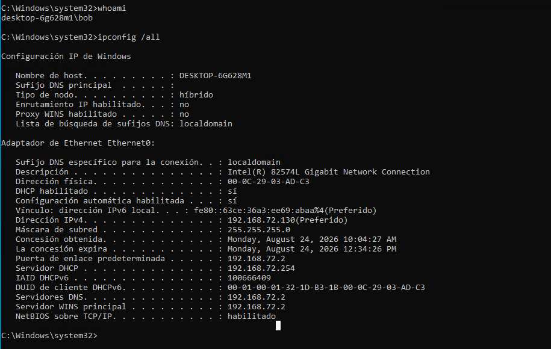

Then checked local accounts and administrative membership:

```
net user
net localgroup administrators
```

`net user` listed Administrator, bob, DefaultAccount, Guest, and WDAGUtilityAccount. `net localgroup administrators` showed only Administrator and bob holding admin rights at this point.

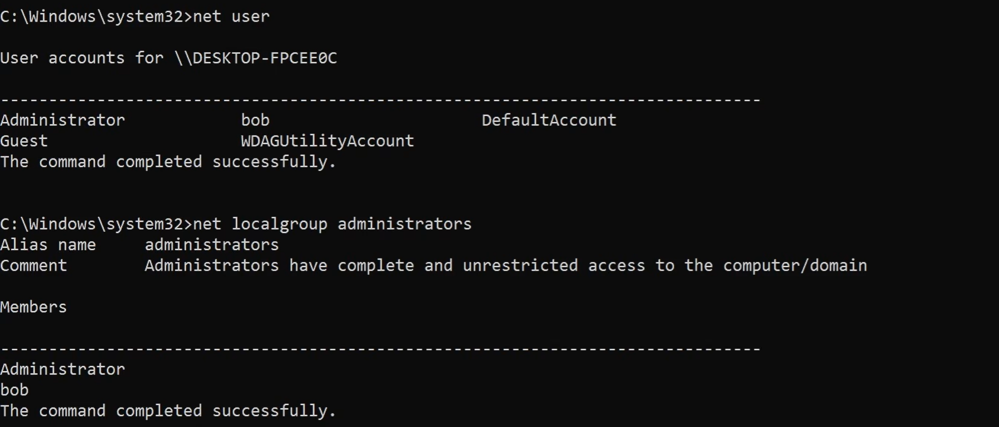

The Guest account is disabled by default. Enabled it:

```
net user guest /active:yes
```

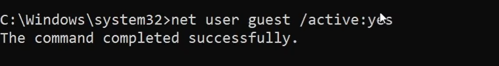

Then set a password on it. I'm not including the actual value used here, only the fact that the command ran successfully.

```
net user guest [password]
```

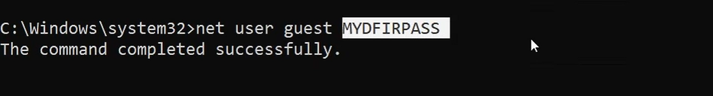

Created a new local account and elevated it to Administrators, a common persistence pattern:

```
net user student1 password /add
net localgroup administrators student1 /add
net localgroup administrators
```

The verification listing confirmed student1 now sat alongside Administrator and bob in the Administrators group.

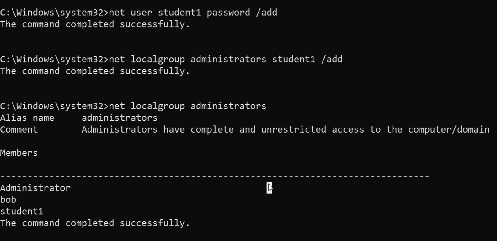

Deleted the account to generate a deletion event as well:

```
net user student1 /delete
```

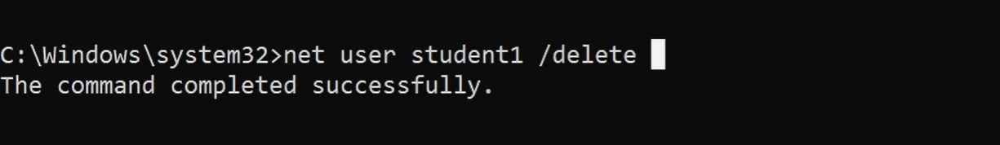

### Phase 2: Reading the Windows Telemetry in Wazuh

Switched to the dashboard, Discover, `wazuh-archives-*` index, time filter set to the last 15 minutes.

Filtered by `agent.name: mydfir-windows` and `data.win.system.eventID: 4726` (account deletion) to confirm the deletion I'd just performed was captured.

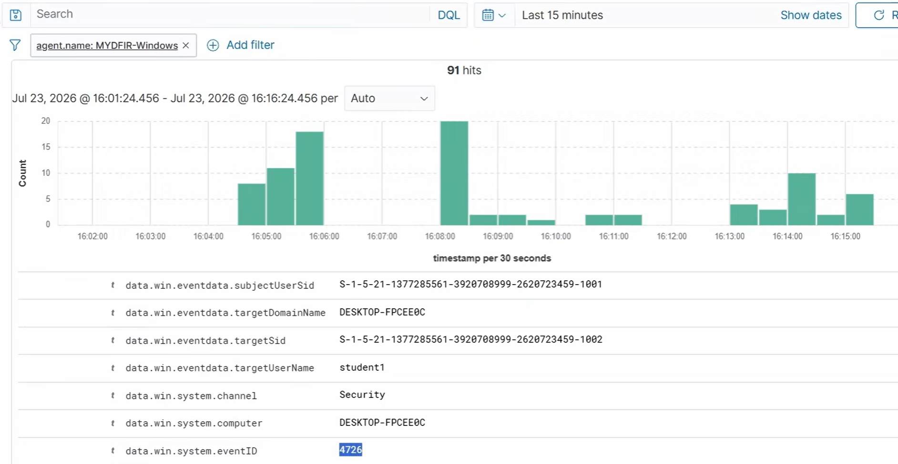

Expanded the event and read `data.win.system.message`. The Subject block shows who performed the action, bob, with a SID ending in RID 1001. The Target block shows who was affected, student1, with a SID ending in RID 1002.

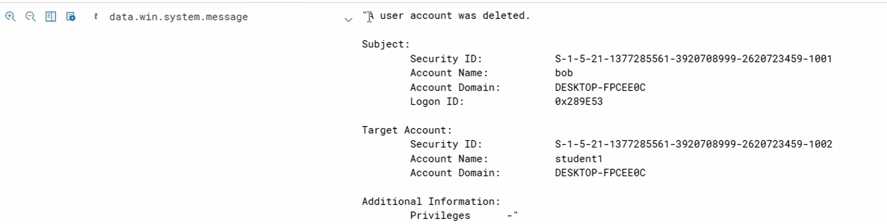

Filtered next on `data.win.system.eventID: 4720` (account creation). One hit, matching the student1 creation from Phase 1.

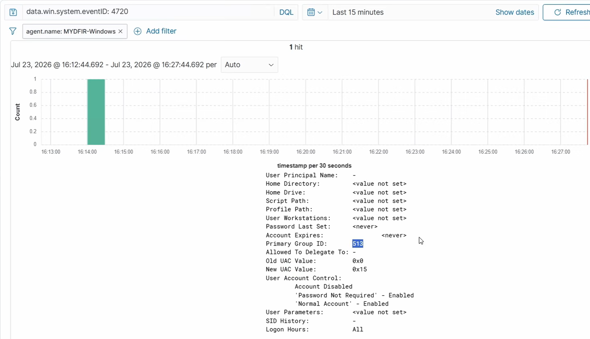

Logged into the Windows VM directly through the VMware console rather than RDP, to generate an interactive logon distinct from a remote one, then filtered on `data.win.system.eventID: 4624` (successful logon).

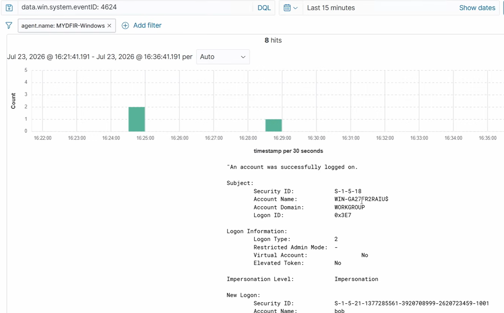

The Logon Type field read 2, meaning interactive, console-based authentication, matching how I'd just logged in. The New Logon block confirmed the account, bob, with the same SID and RID 1001 seen in the earlier events.

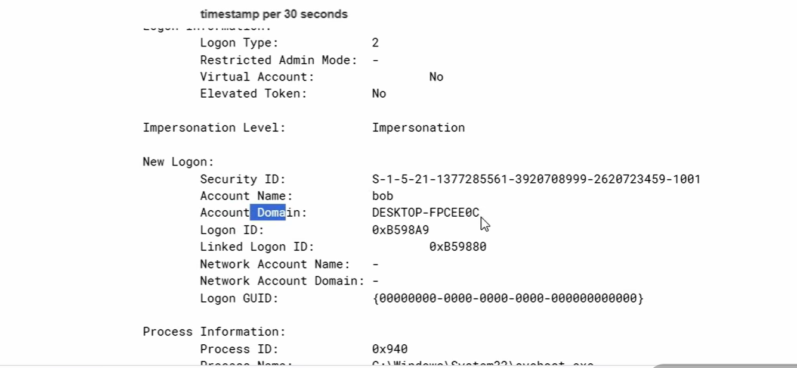

The Logon ID and Linked Logon ID fields on this event let an analyst chase every subsequent action tied to this specific session, the same role a process ID plays when pull-threading through process telemetry.

Filtered on `data.win.system.eventID: 4732` (member added to a local group), expanding the time filter to the last 24 hours to catch it. The message read "A member was added to a security-enabled local group." The Subject confirmed bob performed the action, and the Group block confirmed the target group was Administrators.

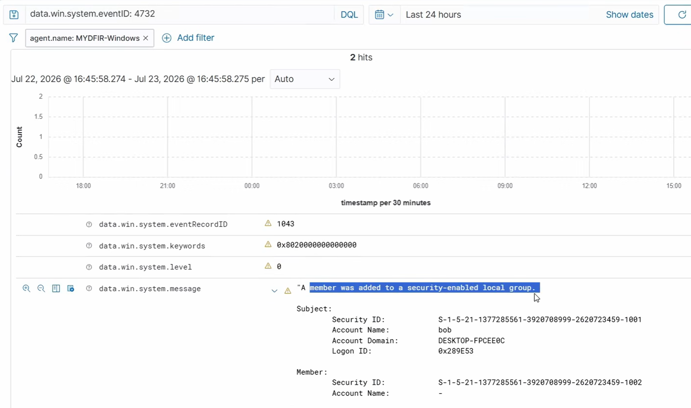

Worth noting here: Windows does not log the actual account name of the member added in this event, only their SID, the Account Name field shows a dash. To resolve who was actually added, I copied the raw SID from the Member block and ran it as a new search on its own.

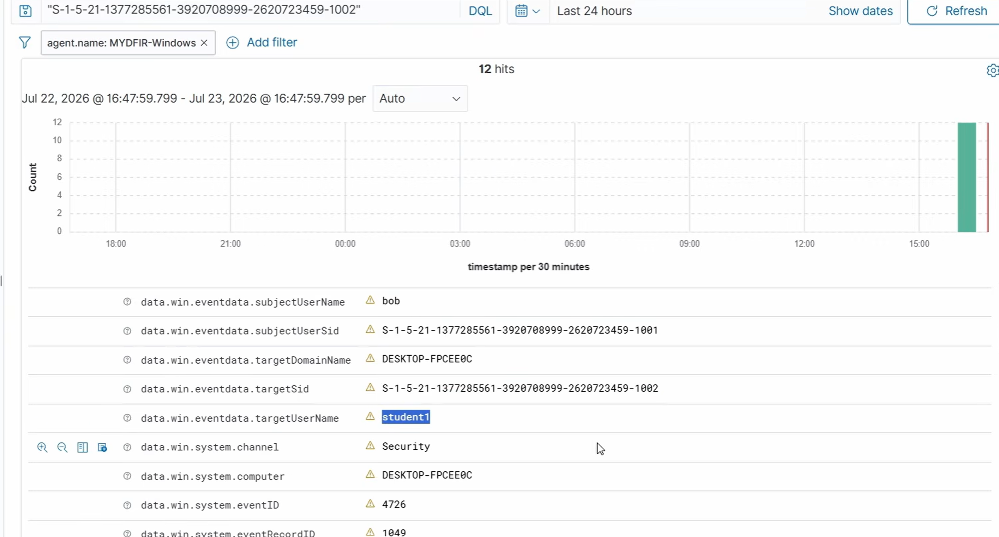

That search surfaced the earlier 4726 deletion event, which does populate `data.win.eventdata.targetUserName` with the same SID, resolving to student1. This is a reusable technique: when a field is blank or shows a dash, pivot on whatever identifier is present (SID, RID) and search for it independently rather than assuming the value is unrecoverable.

### Phase 3: Generating Telemetry on the Linux Endpoint

From a PowerShell session on the Windows VM, attempted an SSH connection to the Ubuntu endpoint using a fake username and deliberately wrong passwords, entering incorrect credentials until the connection was refused.

```powershell
ssh fakeuser@192.168.136.129
```

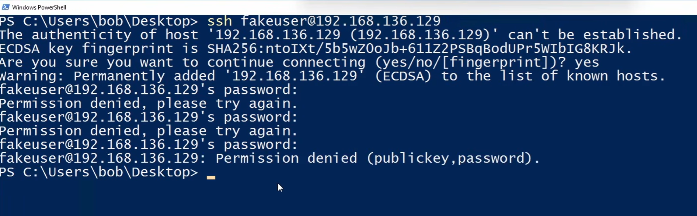

One thing worth flagging honestly rather than glossing over: the target address used in this command, 192.168.136.129, doesn't match the 192.168.72.129 address established for the Linux endpoint in Part 1. The Wazuh-side logs recovered in the next phase consistently show 192.168.72.x addresses for this traffic, so the discrepancy looks like a stale or reused address in the command itself rather than a change in the endpoint's actual IP. I'm noting it here rather than quietly reconciling it, since I can't confirm the cause from the data available.

Then SSH'd in using valid credentials and ran basic reconnaissance:

```
ip a
whoami
```

`ip a` confirmed the endpoint's address as 192.168.72.129/24 on interface ens33. `whoami` returned gerard.

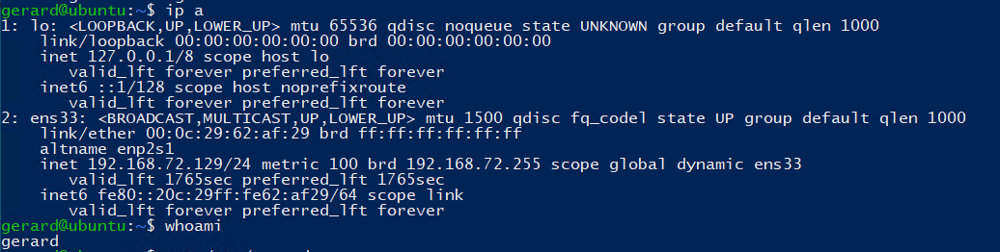

Also ran, without capturing screenshots of either:

```
cat /etc/passwd
cat /etc/passwd > /tmp/loot.txt
```

The first simply reads the local account list. The second simulates an attacker reading a sensitive system file and staging the output in a temporary location for later exfiltration, a pattern worth being able to recognize in file-creation telemetry even without a screenshot to show for it here.

### Phase 4: Reading the Linux Telemetry in Wazuh

Removed the Windows agent filter and searched the keyword `fakeuser` to find the failed SSH attempts.

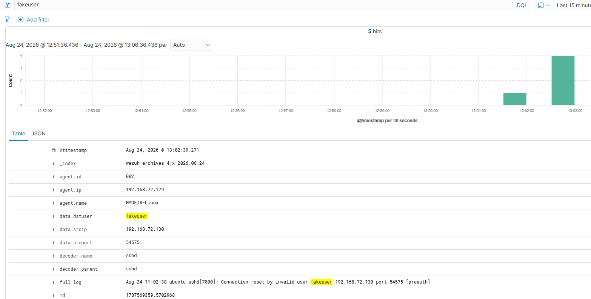

Two distinct log lines came back: one showing the connection reset by invalid user, and a separate one showing the failed password attempt itself.

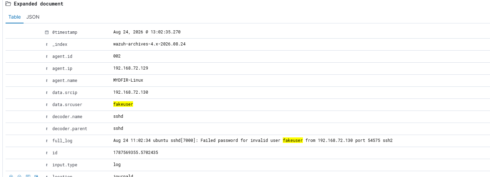

Both events sourced from `sshd`, with `data.srcip` pointing at the Windows VM's address (192.168.72.130), the machine the SSH attempt originated from.

Searched `gerard AND Accepted` to confirm the successful authentication that followed.

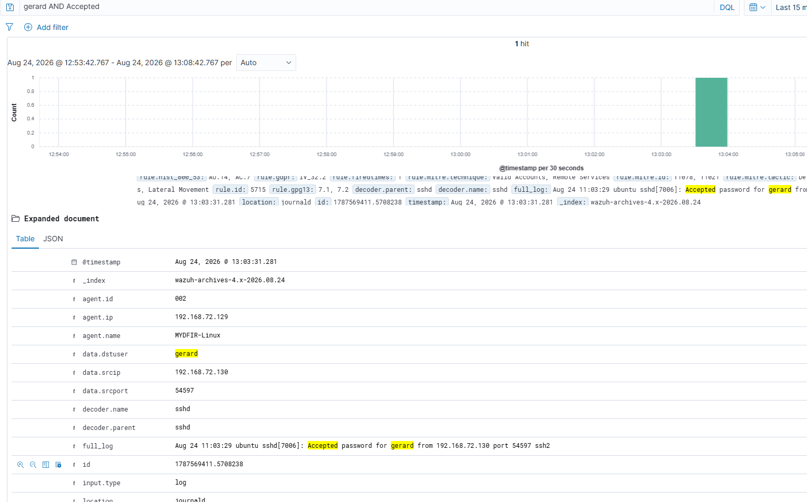

The log read "Accepted password for gerard," confirming the valid SSH session.

Searched `gerard AND session` next, to see how Linux tracks the session itself rather than just the authentication event.

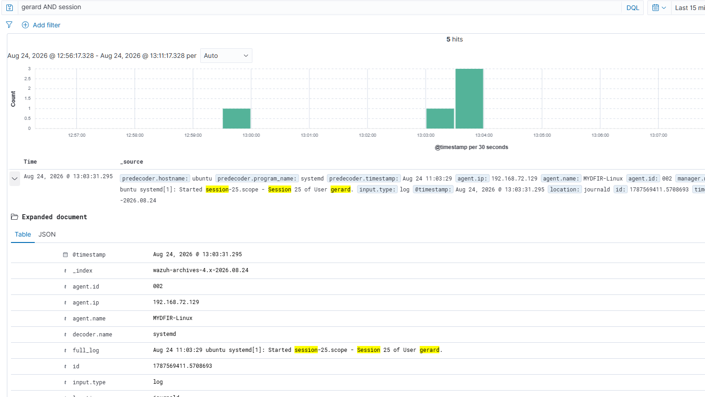

`systemd` recorded "Started session-25.scope - Session 25 of User gerard." This session number is the Linux equivalent of the Windows Logon ID, a stable identifier that can be used to pull every action tied to this login, and Sysmon for Linux carries this same value in its `TerminalSessionId` field, meaning the two log sources can be correlated on it.

Expanded the corresponding `pam_unix` entry to see the SSHD process ID tied to this session.

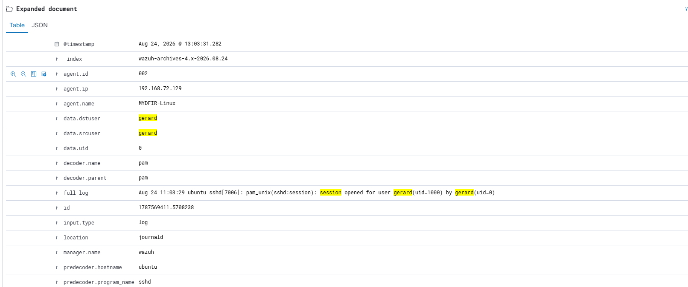

PID 7006 is now a second, independent pivot point, alongside the session ID, for chasing whatever this user did during this login. `ip a` executed earlier in the session shows up in Sysmon telemetry under this same PID, confirming the correlation works in practice and not just in theory.

### Phase 5: Creating the Base Dashboard

From the hamburger menu, went to Dashboards under the OpenSearch Dashboards section (a distinct area from the main Wazuh plugin navigation), clicked Create new dashboard, then Create new to add the first visualization. The visualization type picker lists Area, Controls, Coordinate Map, Data Table, Gantt Chart, Gauge, Goal, Heat Map, Horizontal Bar, Line, Maps, Markdown, Metric, Pie, Region Map, TSVB, Tag Cloud, Timeline, Vega, Vertical Bar, and VisBuilder.

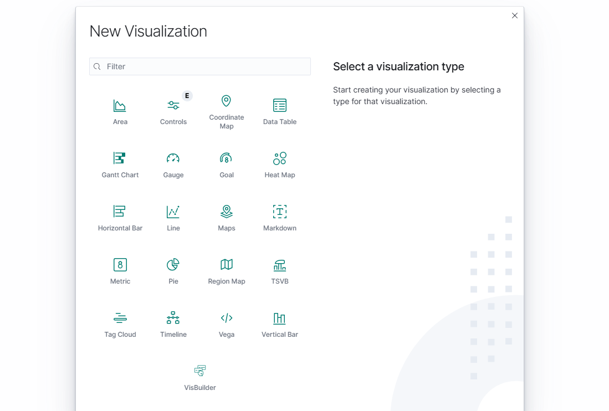

### Phase 6: Panel 1, Metric (Failed Windows Logons)

A Metric visualization is a single bold number, well suited for tracking a high-level count like total failed authentications at a glance.

Selected Metric as the type and `wazuh-archives-*` as the index. With no filter applied, the count showed 28,782, the total raw event volume in the index.


Entered the query to isolate Event ID 4625 (Failed Logon):

```
data.win.system.eventID: 4625
```

The metric updated to 3, matching the number of failed logon attempts actually generated during this session.

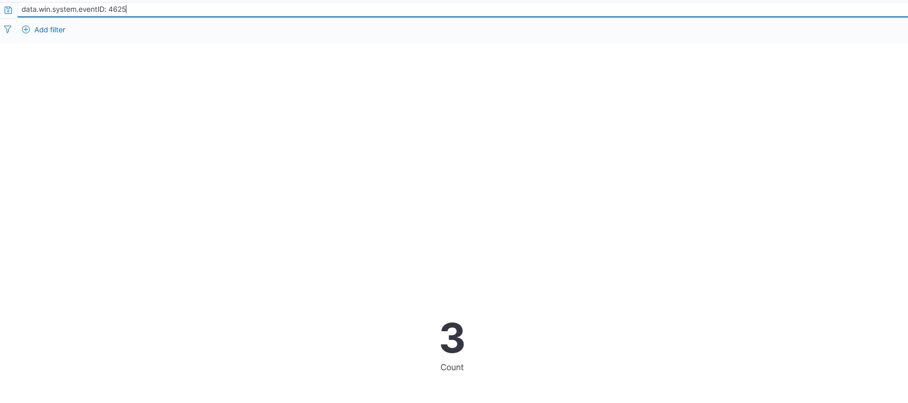

Saved it as "Failed Windows Logon" and returned to the dashboard canvas. Named the overall dashboard "Basic SOC Activity Overview" through the save dialog, the title that will hold all three panels.

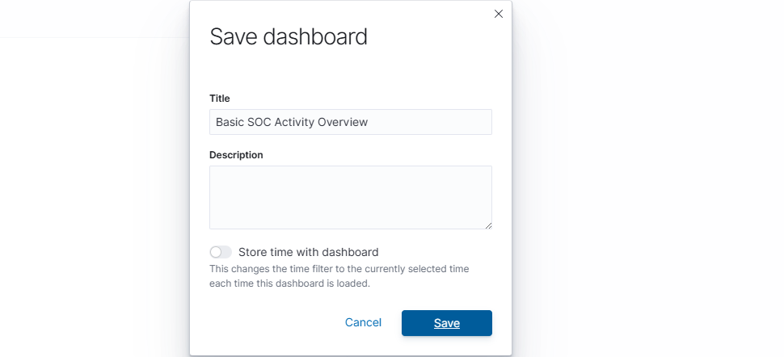

### Phase 7: Panel 2, Line Chart (Windows Account Changes Over Time)

A line chart is the right shape for tracking volume spikes over time. This panel targets a bundle of event IDs that together represent an attacker manipulating user accounts: creation, modification, and deletion events.

Clicked Edit, Add, Create new panel, selected Line as the type and `wazuh-archives-*` as the index. In the query bar, entered the bundled account-change query:

```
data.win.system.eventID: ("4720" OR "4722" OR "4724" OR "4725" OR "4726" OR "4732" OR "4733" OR "4738")
```

Data came back, but as a single dot rather than a usable line, since neither axis had been configured yet.

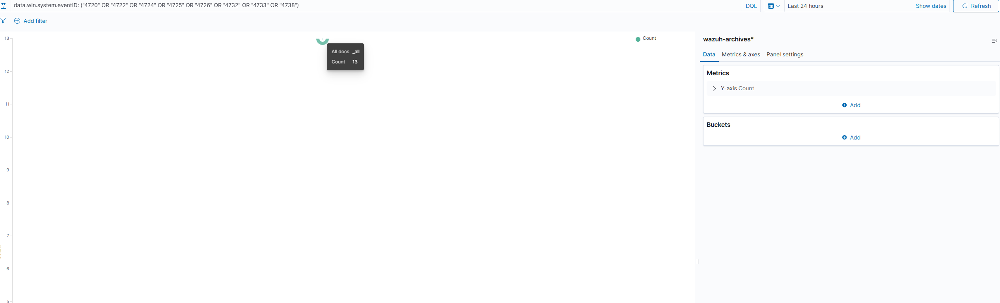

Left the Y-axis on the default Count aggregation, then configured the X-axis: Aggregation set to Date Histogram, Field set to `timestamp`.

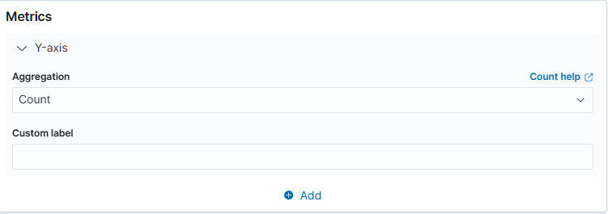

Next tried to split the chart by event ID so each ID would render as its own colored line, Add, Split series, Aggregation Terms, Field `data.win.system.eventID`. The field came back missing.

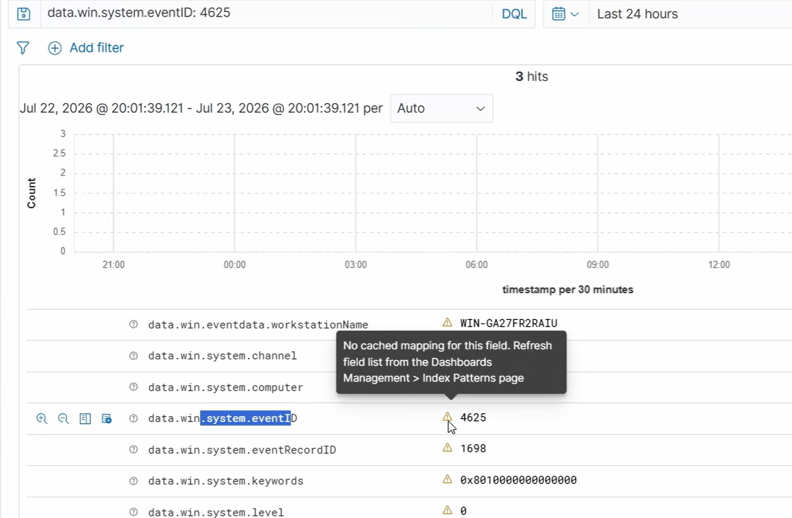

This is a known Wazuh dashboard behavior: when new log types get ingested, the dashboard's field cache doesn't always pick up the new field names immediately. The fix is a manual refresh of the index pattern rather than anything in the panel itself. Covered in detail in Troubleshooting Notes below.

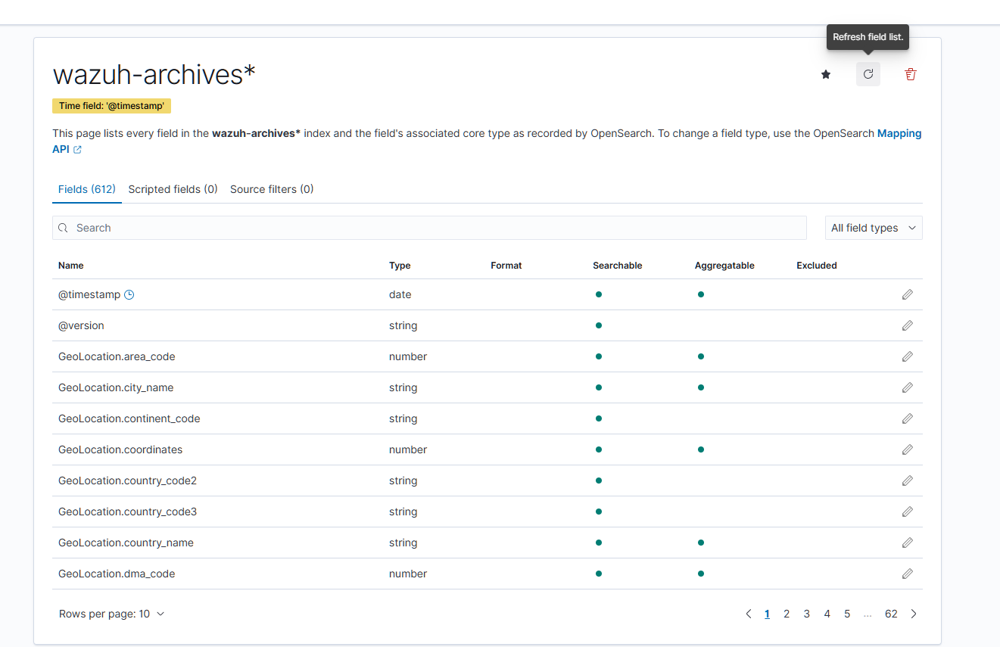

After the refresh, the field count jumped noticeably, and `data.win.system.eventID` became available. Configured the split series aggregation with it: Terms, ordered by Count descending.

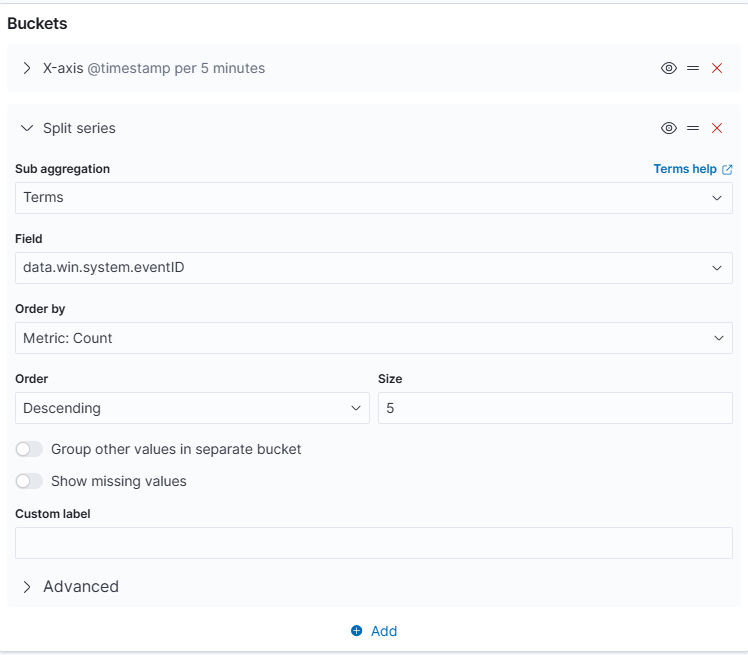

Clicked Update. The chart rendered with a distinct colored line per event ID present in the data, 4726, 4733, 4738, 4722, 4724, 4732, and 4720.

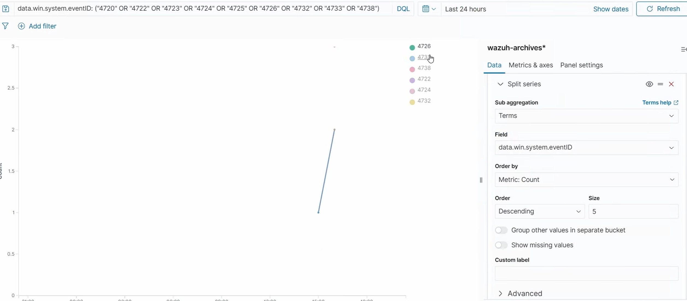

Saved it as "Windows Account Changes Over Time" and returned to the dashboard, now showing both panels side by side.

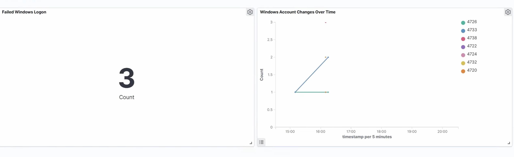

### Phase 8: Panel 3, Data Table (Linux Failed SSH Logins)

A Data Table gives structured, row-by-row detail, which is what's needed for failed SSH attempts: exactly when each attempt happened, who tried to log in, and what IP it came from.

Clicked Add, Create new panel, selected Data Table, chose `wazuh-archives-*`. Added a filter, `agent.name` is `mydfir-linux`, then searched `"Failed password"` (with quotes) in the main search bar. Three results came back, showing only a raw count at this point since no row structure had been defined yet.

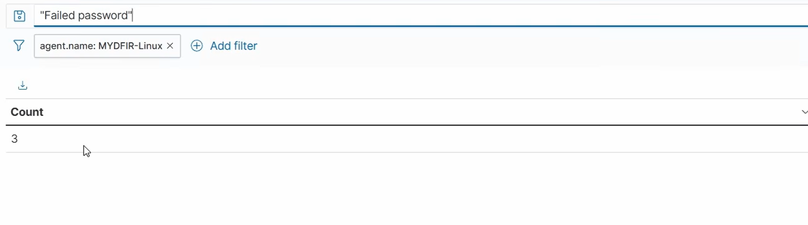

Built out the table structure through a series of Split row aggregations, each using Terms:

- Row 1 (Agent): `agent.name`
- Row 2 (Time): `timestamp`
- Row 3 (Source User): `data.srcuser`, the field that populates when an attacker tries a fake username
- Row 4 (Destination User): `data.dstuser`, which came back empty until toggling "Show missing values," after which it populated as "Missing"
- Row 5 (Source IP): `data.srcip`

The finished table listed three rows, all attributed to MYDFIR-Linux, with fakeuser in the source user column, Missing in the destination user column, and the source IP populated for each attempt.

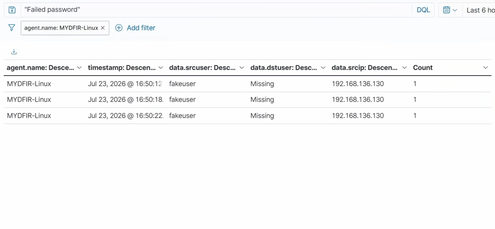

Saved it as "Linux Failed SSH Authentication Activity" and returned to the dashboard.

### Phase 9: Finalizing the Dashboard

Arranged the three panels by dragging their corners into a usable layout, then clicked Save in the top menu to lock in the final "Basic SOC Activity Overview" dashboard: the Metric top left, the Line Chart top right, the Data Table underneath.

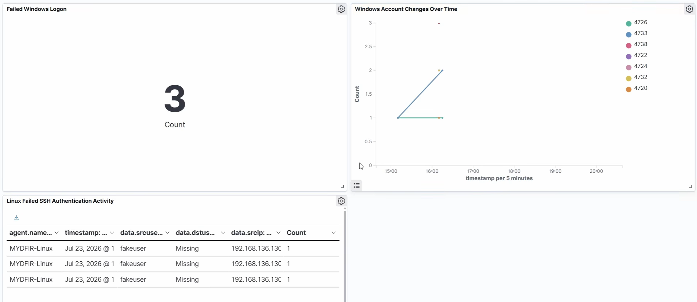

## Troubleshooting Notes

**Missing field mapping on newly ingested log types.** When Wazuh ingests a log type the dashboard hasn't indexed a field mapping for yet, aggregation-based panels (Terms, Split series, Split rows) can fail to find that field even though it's clearly present in Discover. The symptom is a warning triangle or a "No cached mapping for this field" tooltip when trying to select it in a visualization's Data tab. The fix isn't in the panel configuration at all, it's in Dashboard Management, Index Patterns, selecting the relevant pattern (`wazuh-archives-*` here), and clicking Refresh field list. This forces the dashboard to re-scan the index and pick up field names it missed on first ingestion.

## Implications for a SOC Analyst

Reading raw Windows Security events means learning to separate Subject from Target on every event, not just skimming for a username. The Subject block answers who did something, the Target block answers who or what it was done to, and conflating the two produces a backwards read of the event, attributing an action to the account it happened to rather than the account that performed it. Across this session, the account lifecycle read cleanly once that distinction was kept straight: 4720 for creation, 4732 for the group elevation, 4624 for the logon, 4726 for the deletion, four separate events that only tell a coherent story when each one's Subject and Target are read correctly.

The blank Account Name in the 4732 event is a small but genuinely useful lesson. Windows doesn't always resolve a SID to a friendly name inside the event that generated it. Treating a dash as a dead end would have meant losing the identity of the account added to Administrators. Pivoting on the raw SID as its own search term, independent of the event it came from, recovered that identity from a different event entirely. That's a pattern worth carrying into any SIEM: a blank or unresolved field is a cue to search on whatever raw identifier is present, not a stopping point.

Logon ID and Linked Logon ID on Windows, and session ID paired with the SSHD process ID on Linux, are doing the same job across two completely different logging systems. Both give an analyst a stable handle to pull every subsequent action tied to a specific login, the same underlying principle behind pull-threading through process telemetry by PID. Recognizing that Windows and Linux express the same correlation concept through different field names is more useful long-term than memorizing either platform's specific fields in isolation, since the next unfamiliar SIEM will express it through yet another set of names.

Building the dashboard itself was a small exercise in detection engineering judgment, deciding what data deserves a single headline number versus a trend versus full row-level detail. A Metric answers "how many," fast, at a glance, and nothing else. A Line Chart answers "when," showing whether activity clusters or spreads out. A Data Table answers "who, from where, and exactly when," at the cost of taking longer to read. None of the three is a strictly better choice than the others, the right one depends on what question the panel needs to answer at a glance versus what a full pivot into Discover is still needed for. The field-mapping issue encountered along the way is also a reminder that a dashboard panel can silently fail to find data it should have access to, for reasons that have nothing to do with the query being wrong, worth checking before assuming a panel's blank result means the underlying telemetry itself is missing.

---

*Part 2 of a multi-part SOC home lab series built with Wazuh 4.14. Part 3 covers File Integrity Monitoring and custom detection rules.*