# Hardening du Microsoft Defender Antivirus via GPO

**Environnement :** Lab virtuel de Windows Hardening sur Microsoft Defender Antivirus — Formation Analyste SOC - CyberUniversity (Liora x Sorbonne).

# Objectif du Lab
L'objectif de ce laboratoire est de configurer et de durcir l'antivirus natif Microsoft Defender sur un système Windows en appliquant les bonnes pratiques de sécurité. Je dois m'assurer que les défenses de l'hôte sont optimisées contre les menaces avancées et les attaques Zero-Day, tout en préservant les artefacts nécessaires à une investigation numérique ultérieure.

# Outils et Technologies Utilisées
* Système d'exploitation Windows 10/11.
* Antivirus natif Microsoft Defender.
* Éditeur de Stratégie de Groupe locale (gpedit.msc).

# Contenus du Lab

## 1. Prise en Main de l'Éditeur de Stratégie de Groupe (GPO)
**Contexte SOC / Blue Team :** En environnement d'entreprise, il est impensable de configurer un antivirus via l'interface graphique poste par poste. J'utilise les Stratégies de Groupe (GPO) pour imposer une configuration stricte qui ne pourra pas être modifiée ou contournée par l'utilisateur final.

**Chemin :**
J'ai ouvert l'outil via l'invite d'exécution avec la commande `gpedit.msc`.

Je me suis ensuite rendu dans l'arborescence : `Configuration ordinateur > Modèles d'administration > Composants Windows > Antivirus Microsoft Defender`.

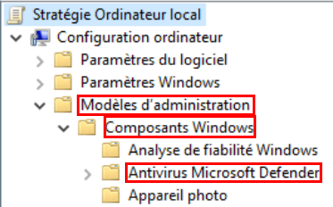

**Stratégie :** `Turn off Microsoft Defender Antivirus` (Désactiver l'Antivirus Microsoft Defender).
* **Configuration :** Désactivé.
* **Explications :** En raison de la logique de double négation de Microsoft, configurer cette stratégie sur "Désactivé" permet d'empêcher la désactivation de l'antivirus, forçant ainsi son exécution de manière permanente sur le système.

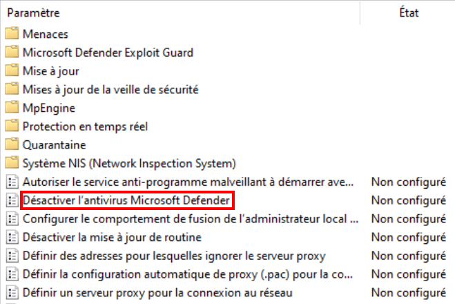

## 2. Configuration de la Protection Cloud (MAPS et BAFS)
**Contexte SOC / Blue Team :** Les attaquants modifient constamment leurs codes malveillants pour échapper aux détections basées sur les signatures traditionnelles. J'active les services Cloud (MAPS) et l'analyse comportementale pour identifier et bloquer les menaces Zero-Day de manière proactive, avant même qu'une signature ne soit déployée.

**Chemin :** `... > Antivirus Microsoft Defender > MAPS`.

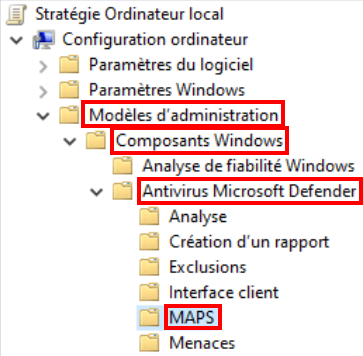

**Stratégies et Configurations :**
* `Configure local setting override for reporting to Microsoft MAPS` :
  * **Configuration :** Désactivé.
  * **Explications :** Cela empêche les paramètres locaux de prendre le dessus, garantissant que la stratégie de groupe imposée reste prioritaire.

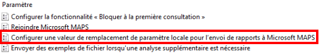

* `Join Microsoft MAPS` :
  * **Configuration :** Activé avec l'option "MAPS Avancé".
  * **Explications :** Cette configuration autorise l'envoi d'informations complémentaires et détaillées sur les logiciels suspects pour alimenter la veille de sécurité de Microsoft en temps réel.

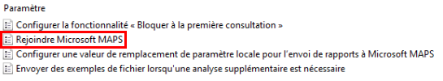

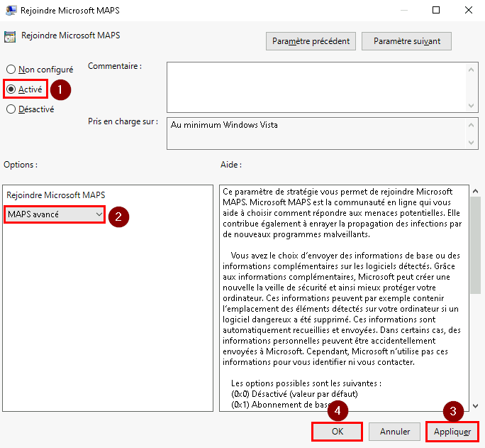

* `Configure the 'Block at First Sight' feature` :
  * **Configuration :** Activé.
  * **Explications :** La fonctionnalité BAFS permet à l'antivirus de bloquer temporairement un exécutable inconnu téléchargé, de l'envoyer dans le Cloud pour une analyse approfondie, et de le bloquer définitivement s'il est jugé malveillant, le tout en seulement quelques secondes.

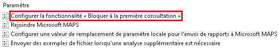

* `Send file samples when further analysis is required` :
  * **Configuration :** Activé avec l'option "Envoyer des échantillons sécurisés".
  * **Explications :** J'autorise l'envoi automatique d'échantillons de fichiers suspects au Cloud pour permettre au moteur BAFS de fonctionner efficacement sans exposer de données personnelles.

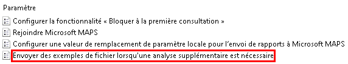

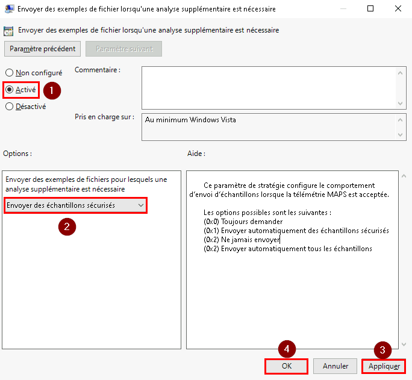

## 3. Paramètres du Moteur de Protection (MpEngine)
**Contexte SOC / Blue Team :** Le Malware Protection Engine est le cœur de l'analyse du système. En tant qu'analyste défensif, je préfère définir un niveau de blocage très strict pour minimiser les risques de compromission initiale, quitte à devoir trier quelques faux positifs par la suite.

**Chemin :** `... > Antivirus Microsoft Defender > MpEngine`.

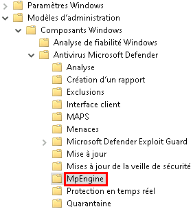

**Stratégies et Configurations :**
* `Configure extended cloud check` :
  * **Configuration :** Activé en spécifiant la valeur "50".
  * **Explications :** J'augmente le temps alloué au Cloud pour analyser un fichier suspect. Le fichier reste bloqué pendant un délai maximal de 60 secondes (10 secondes par défaut couplées aux 50 secondes étendues) le temps que l'analyse se termine.

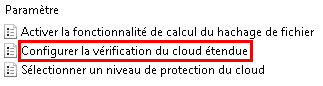

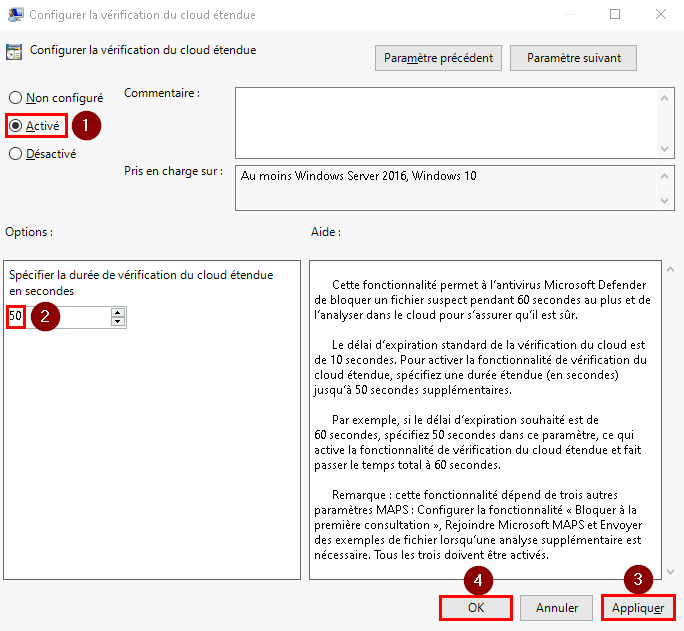

* `Select cloud protection level` :
  * **Configuration :** Activé avec l'option "Niveau de blocage élevé".
  * **Explications :** Ce paramètre définit le niveau d'agressivité de l'antivirus. Ce réglage est le minimum indispensable pour sécuriser un poste standard, et je l'augmenterais pour des postes critiques tels que ceux utilisés par les administrateurs.

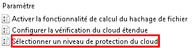

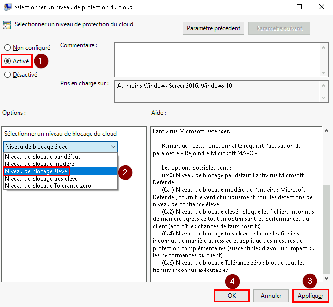

## 4. Gestion de la Quarantaine (Objectif Forensic)
**Contexte SOC / Blue Team :** Lors de la détection d'une menace, la suppression automatique et définitive d'un malware détruit une preuve numérique cruciale. Pour pouvoir faire du Reverse Engineering et comprendre les mécanismes de l'attaque, je dois m'assurer que les artefacts interceptés sont conservés de manière sécurisée.

**Chemin :** `... > Antivirus Microsoft Defender > Quarantine`.

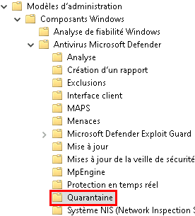

**Stratégie :** `Configure removal of items from Quarantine folder`.
* **Configuration :** Désactivé.
* **Explications :** En désactivant cette stratégie, j'empêche la purge automatique du dossier de quarantaine. Les menaces identifiées sont ainsi isolées et conservées indéfiniment pour les besoins ultérieurs de l'investigation numérique.

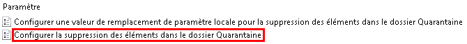

## 5. Le Bouclier Actif : Protection en Temps Réel
**Contexte SOC / Blue Team :** La protection en temps réel est notre principale ligne de défense pour intercepter l'exécution de processus malveillants à la volée. Les acteurs malveillants cherchent systématiquement à la désactiver avant de lancer leur charge utile (payload). Je dois donc m'assurer qu'elle couvre l'ensemble des activités système de façon ininterrompue.

**Chemin :** `... > Antivirus Microsoft Defender > Real-time Protection`.

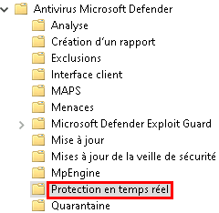

**Stratégies et Configurations :**
* `Scan all downloaded files and attachments` : Activé. Cela garantit l'analyse systématique de toutes les pièces jointes et téléchargements entrants.

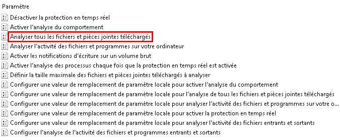

* `Turn off real-time protection` : Désactivé. Suivant la logique de double négation, cela force la protection en temps réel à rester active en permanence et impose les invites de protection.

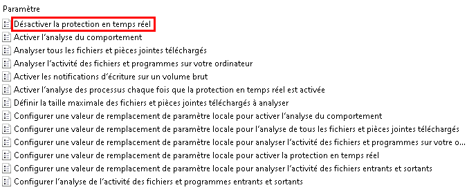

* `Turn on behavior monitoring` : Activé. C'est un prérequis indispensable pour détecter les malwares inconnus en se basant sur leur comportement.

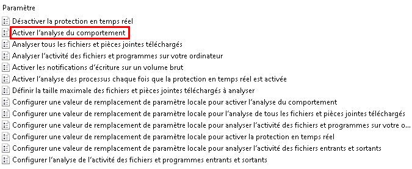

* `Turn on process scanning whenever real-time protection is enabled` : Activé. Cette stratégie est critique car elle permet d'intercepter des programmes malveillants qui auraient pu démarrer furtivement si la protection avait été momentanément interrompue.

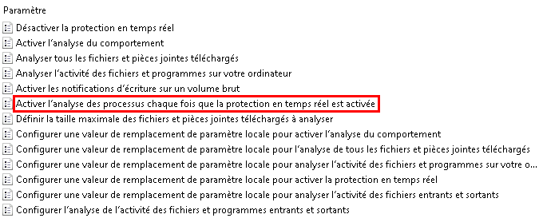

* `Monitor file and program activity` : Activé. Cette configuration m'assure que toute activité effectuée sur les fichiers et programmes est scrupuleusement analysée.

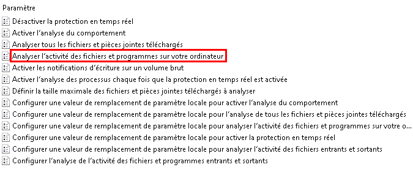

## 6. Stratégies d'Analyse (Scans et Périphériques)
**Contexte SOC / Blue Team :** Le bouclier en temps réel ne suffit pas à lui seul. J'ai besoin de configurer des analyses planifiées et profondes pour détecter des malwares inactifs, des menaces apportées par des vecteurs physiques (comme les clés USB) ou des codes malveillants camouflés dans des formats d'archives.

**Chemin :** `... > Antivirus Microsoft Defender > Scan`.

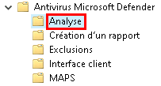

**Stratégies et Configurations :**
* `Allow users to pause scan` : Désactivé. Un utilisateur final ne doit jamais avoir la capacité de suspendre un processus critique d'analyse de sécurité.

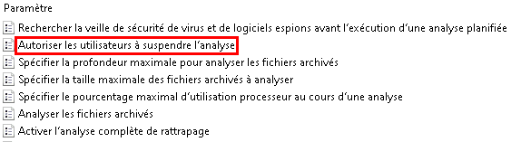

* `Check for the latest virus and spyware definitions before running a scheduled scan` : Activé. Je force une recherche et mise à jour de la veille de sécurité juste avant un scan pour garantir que l'analyse s'effectue avec les signatures les plus récentes.

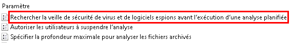

* `Scan archived files` : Activé. Cela autorise l'antivirus à inspecter le contenu des fichiers compressés (comme les .ZIP ou .CAB) très prisés par les attaquants pour dissimuler leurs malwares. Il est essentiel que l'analyse des fichiers exécutables compressés ou offusqués soit maintenue.

* `Scan removable drives` : Activé. Cela permet de contrer les attaques initiées via des périphériques physiques (lecteurs flash USB) en imposant leur analyse lors d'un scan complet.

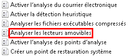

* `Turn on e-mail scanning` : Activé. Le moteur va directement décortiquer et analyser les boîtes aux lettres locales (comme les fichiers .pst ou .dbx) et l'ensemble des pièces jointes associées.

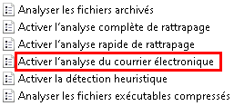

* `Turn on heuristics` : Activé. J'active la détection heuristique pour permettre l'identification proactive de nouvelles variantes de virus qui n'ont pas encore de signature précise.

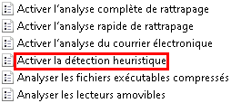

# Implications pour un Analyste SOC
Ce laboratoire met en lumière le fait qu'une configuration par défaut d'un système Windows n'est pas suffisante face aux menaces actuelles. Avec ma casquette Blue Team, le déploiement de ce durcissement par Stratégie de Groupe me permet de garantir que le système intercepte agressivement les menaces Zero-Day en s'appuyant sur le Cloud (MAPS et BAFS). De plus, en forçant la conservation des éléments en quarantaine, je sécurise la préservation des échantillons de malwares. Ces artefacts sont indispensables pour mon travail d'investigation numérique, me permettant d'analyser le code malveillant et d'affiner mes propres règles de détection. Cette approche purement défensive réduit considérablement la surface d'attaque et renforce le contrôle de l'environnement face aux compromissions.

### Limites et perspectives d'architecture SOC :
Protection contre les falsifications (Tamper Protection) : Bien que les GPO forcent la configuration, un malware ayant obtenu une élévation de privilèges (Administrateur ou SYSTEM) pourrait contourner ces règles en modifiant directement le registre. Ce durcissement doit donc impérativement être couplé à l'activation de la Tamper Protection de Microsoft, qui verrouille ces paramètres de sécurité contre toute altération locale.

Visibilité et Centralisation (SIEM) : Le blocage local n'est que la première étape de la réponse à incident. Pour que le SOC puisse réagir, il est indispensable de configurer le Windows Event Forwarding (WEF) ou de déployer un agent de collecte (ex: Splunk Universal Forwarder) afin de remonter les journaux locaux vers le SIEM central, notamment l'Event ID 1116 (Détection de malware) ou l'Event ID 1117 (Action effectuée sur le malware).

---
*Fin du rapport de Lab.*