# Durcissement Windows - Windows Exploit Guard

**Environnement :** Lab virtuel de Windows Hardening sur Windows Exploit Guard — Formation Analyste SOC - CyberUniversity (Liora x Sorbonne).

# Objectif du Lab
L'objectif de ce laboratoire est de configurer et d'appliquer les mesures de prévention des intrusions de Microsoft Defender Exploit Guard (WDEG). À travers ce lab, je vise à réduire la surface d'attaque, bloquer les comportements suspects, sécuriser les dossiers critiques contre les ransomwares et atténuer les vulnérabilités d'exploitation mémoire, tout en garantissant un environnement hautement surveillé et sécurisé.

# Outils et Technologies Utilisées
* Système d'exploitation Windows 10/11.
* Microsoft Defender Exploit Guard (WDEG).
* Éditeur de Stratégie de Groupe locale (gpedit.msc).
* PowerShell (en tant qu'administrateur).
* Outils de simulation d'attaques et scripts malveillants (fichiers JS, VBS, ransomware de test, PUA).

# Contenus du Lab

## 1. Microsoft Defender Exploit Guard

**Contexte SOC / Blue Team :** Les attaquants utilisent fréquemment les fonctionnalités légitimes des systèmes (comme PowerShell, WMI ou les macros Office) pour exécuter leurs attaques (techniques "Living off the Land"). Microsoft Defender Exploit Guard (WDEG) est la suite de prévention des intrusions de Windows 10. Son but n'est pas de chercher des signatures de virus, mais de verrouiller l'appareil en bloquant les comportements suspects et les vecteurs d'attaque courants. L'une de ses composantes phares est la Réduction de la Surface d'Attaque (ASR).

### 1.1 Les quatre composants de WDEG
WDEG est composé de :
* **Protection du réseau (Network Protection) :** Protège le périphérique contre les menaces Web en bloquant tout processus sortant vers des hôtes/IP non fiables.
* **Accès contrôlé aux dossiers (Controlled Folder Access) :** Protège les données sensibles contre les ransomwares en empêchant les processus non fiables de les modifier.
* **Protection contre l'exploitation (Exploit Protection) :** Un ensemble de mesures d'atténuation mémoire (remplaçant EMET).
* **Réduction de la surface d'attaque (ASR) :** Contrôles bloquant les menaces basées sur les logiciels Office, Adobe, les scripts et les e-mails.

### 1.2 Attack Surface Reduction (ASR)
L'ASR cible les comportements logiciels à risque (bien que parfois légitimes) souvent utilisés par les malwares :
* Lancement d'exécutables et de scripts qui tentent de télécharger ou d'exécuter des fichiers.
* Exécution de scripts masqués ou suspects.
* Comportements anormaux des applications au quotidien.

### 1.3 Scénario ASR 1 : Blocage des scripts JS/VBS
Cette règle empêche les scripts de lancer du contenu téléchargé potentiellement malveillant (comportement typique de "Downloader" pour récupérer un C&C).

J'ai commencé par créer un fichier texte.

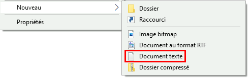

J'y ai inséré un code JavaScript qui se connecte à Bing et lance Notepad, puis je l'ai enregistré sous le format `.js`.

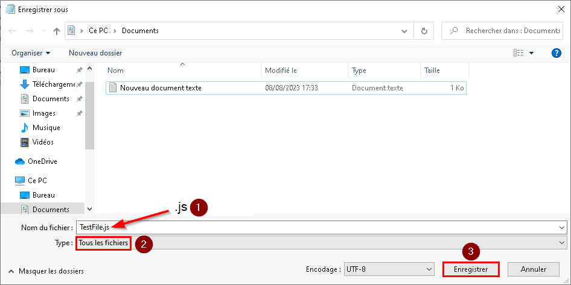

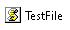

À l'exécution, le bloc-notes s'est ouvert, confirmant que le comportement suspect fonctionne par défaut.

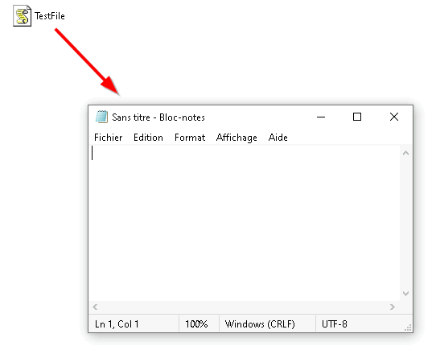

J'ai ouvert PowerShell en tant qu'administrateur pour appliquer la restriction.


J'ai activé la règle avec la commande :
```powershell
`Add-MpPreference -AttackSurfaceReductionRules_Ids D3E037E1-3EB8-44C8-A917-57927947596D -AttackSurfaceReductionRules_Actions Enabled`
```

Après quelques minutes (le temps que la ASR s'active), j'ai modifié le fichier pour lancer `cmd.exe` au lieu de `notepad.exe`.

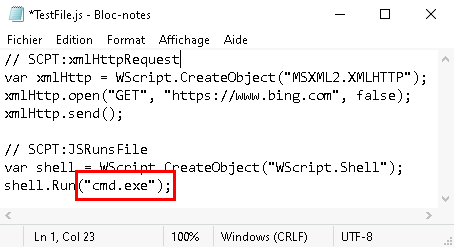

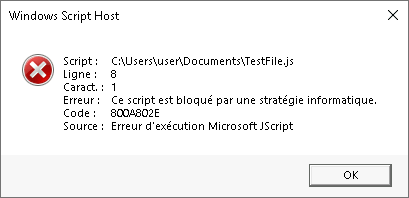

Cette fois-ci, lors de l'exécution, le script a été formellement bloqué par la stratégie informatique, prouvant l'efficacité de la règle ASR.


### 1.4 Scénario ASR 2 : Blocage de PSExec et WMI
La règle ASR cible également l'exécution de code à distance via WMI, souvent abusé pour la propagation latérale sur le réseau.

J'ai créé un fichier `.vbs` de test.

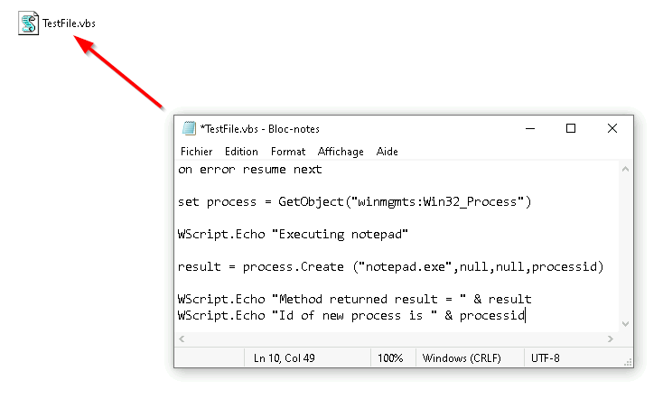

Avant l'activation de la règle, l'exécution a fonctionné : un premier pop-up est apparu, suivi du bloc-notes, puis de l'ID du processus.

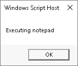

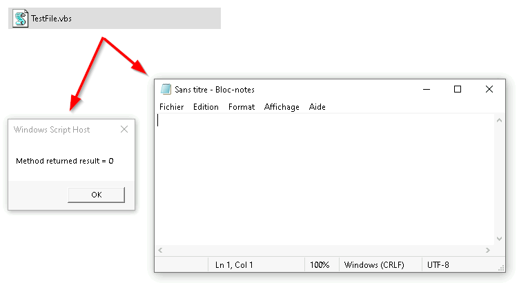

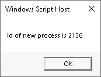

J'ai ensuite activé la règle via PowerShell :
```powershell
`Add-MpPreference -AttackSurfaceReductionRules_Ids D1E49AAC-8F56-4280-B9BA-993A6D77406C -AttackSurfaceReductionRules_Actions Enabled`
```

À la nouvelle exécution, le premier pop-up est apparu.


Cependant, Notepad ne s'est pas lancé, et un code d'erreur a été généré.

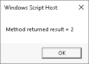

Une notification Windows a confirmé l'action bloquée par l'administrateur. En tant qu'analyste, cette notification génère un journal d'événement précieux pour la détection.

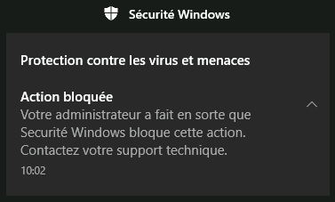

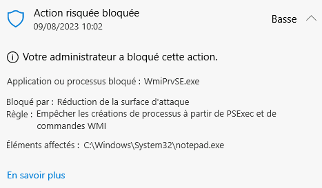

## 2. Controlled Folder Access

**Contexte SOC / Blue Team :** Lors d'une attaque par Ransomware, la rapidité d'exécution du chiffrement est fatale. Le "Controlled Folder Access" (CFA) est une approche Zero-Trust appliquée aux fichiers. Plutôt que de chercher à détecter le ransomware de façon comportementale, on interdit simplement à tout processus inconnu de modifier les dossiers protégés.

J'ai ouvert PowerShell en administrateur pour activer la fonctionnalité.


J'ai activé le CFA avec la commande :

```powershell
`Set-MpPreference -EnableControlledFolderAccess Enabled`
```

Puis, j'ai ajouté mon dossier de démonstration aux dossiers protégés :
```powershell
`Set-MpPreference -ControlledFolderAccessProtectedFolders C:\demo\`
```

J'ai vérifié la présence d'un fichier texte légitime dans le dossier protégé.

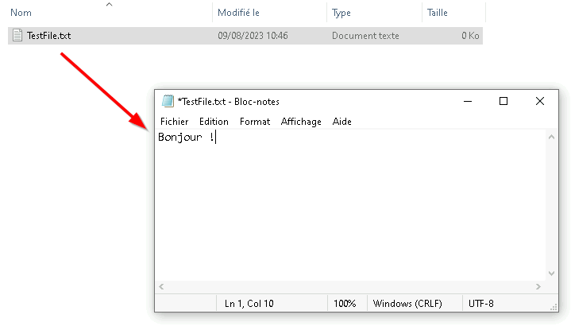

J'ai ensuite exécuté un ransomware de test.

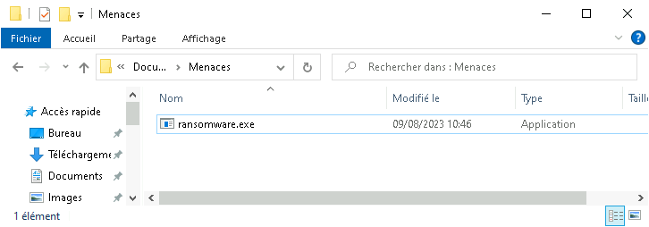

L'accès contrôlé aux dossiers a immédiatement bloqué les modifications non autorisées.


Les détails de l'alerte m'ont confirmé que l'exécutable `ransomware.exe` avait été stoppé avec succès.

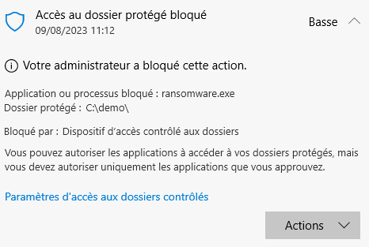

## 3. Microsoft Defender SmartScreen

**Contexte SOC / Blue Team :** L'ingénierie sociale (Phishing) et le téléchargement de malwares sont les vecteurs initiaux les plus courants. SmartScreen analyse la réputation des pages Web et des fichiers en les comparant avec la veille de sécurité de Microsoft. Forcer cette vérification garantit un premier filet de sécurité infranchissable par l'utilisateur.

J'ai ouvert l'éditeur de stratégie locale `gpedit.msc`.

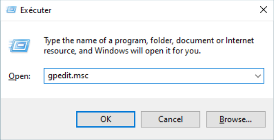

Dans le chemin `Composants Windows > Microsoft Edge`, j'ai sélectionné la stratégie "Configurer Windows Defender SmartScreen".

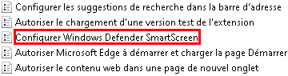

J'ai configuré cette stratégie sur Activé.

Pour empêcher les utilisateurs d'ignorer ces avertissements, j'ai configuré les options d'empêchement de contournement.

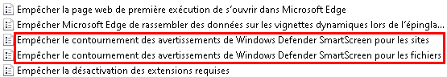

J'ai activé la stratégie "Empêcher le contournement des avertissements Windows Defender SmartScreen pour les sites".

J'ai également activé la stratégie "Empêcher le contournement des avertissements Windows Defender SmartScreen pour les fichiers non vérifiés".

Pour l'Explorateur de fichiers, dans `Composants Windows > Explorateur de fichiers`, j'ai sélectionné "Configurer Windows Defender SmartScreen".

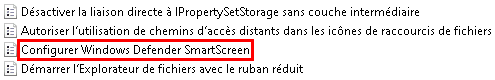

J'ai activé la stratégie avec l'option "Avertir et empêcher tout contournement".

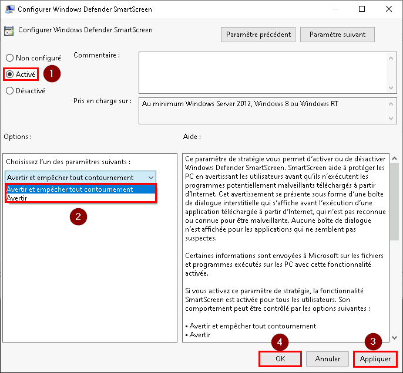

## 4. Réputation des URLs

**Contexte SOC / Blue Team :** SmartScreen identifie dynamiquement le contenu malveillant sur le Web. Au cours de ce lab, j'ai testé les différentes réactions du système face à plusieurs catégories de menaces hébergées en ligne.

* **Protection contre les sites de phishing potentiels :** Le système affiche un avertissement incitant à la prudence.

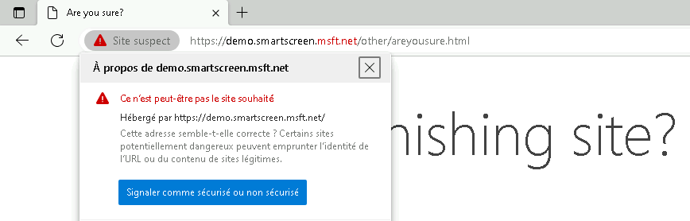

* **Protection contre les sites de phishing connus :** Un avertissement rouge bloquant strict apparaît.


* **Protection contre les sites hébergeant des logiciels malveillants :** Un avertissement rouge spécifique aux programmes malveillants bloque l'accès.

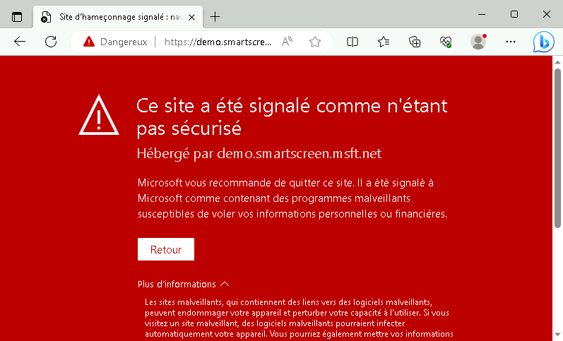

* **Téléchargement bloqué :** Blocage direct du fichier au niveau du navigateur, en se basant sur la réputation de l'URL source.

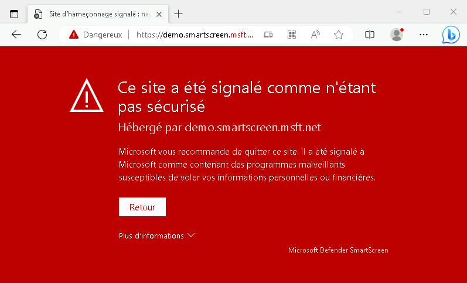

* **Page d’exploit (Vulnérabilité du navigateur) :** Avertissement rouge indiquant une tentative d'exploitation.

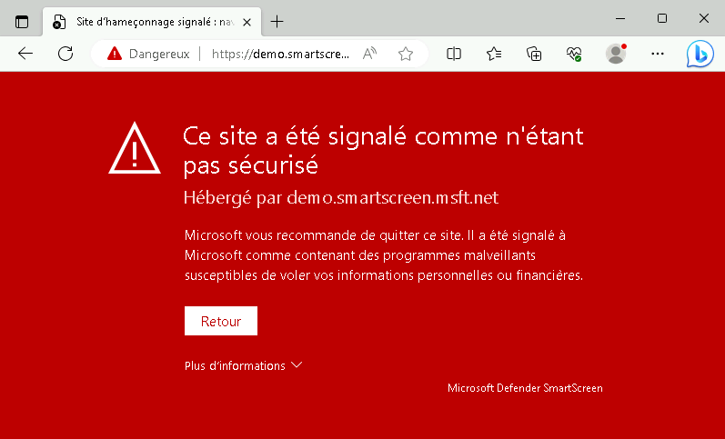

* **Publicité malveillante (Malvertising) :** Blocage localisé de la frame publicitaire malveillante tout en chargeant le reste de la page saine.

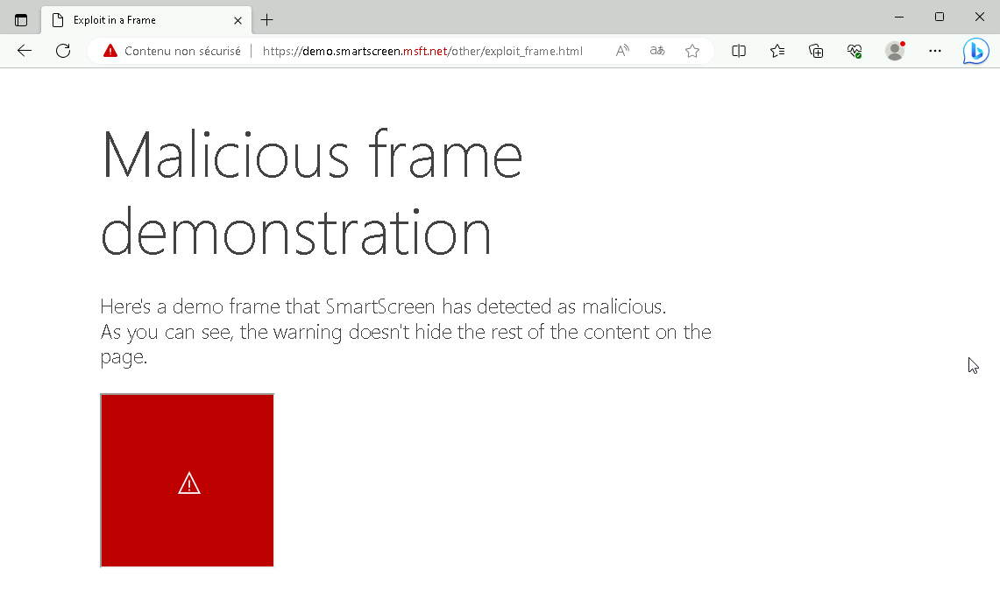

## 5. SmartScreen app reputation

**Contexte SOC / Blue Team :** Au-delà de l'URL, le fichier lui-même possède une réputation (signature, prévalence, âge). Un fichier jamais vu ailleurs dans le monde est considéré suspect, car il peut s'agir d'un malware polymorphe ou d'une attaque ciblée.

* **Fichier connu (bonne réputation) :** Le téléchargement et l'exécution s'effectuent sans interruption.

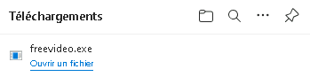

* **Fichier inconnu (réputation faible ou inexistante) :** Le système génère un avertissement indiquant que le fichier n'est pas fréquemment téléchargé.

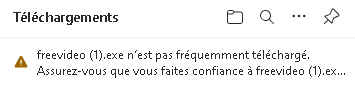

* **Fichier malveillant connu :** Le fichier est bloqué et supprimé immédiatement.

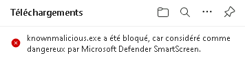

## 6. PUA : Potentially Unwanted Applications

**Contexte SOC / Blue Team :** Les PUA ne sont pas des virus au sens strict, mais des logiciels indésirables (Adwares, barres d'outils, optimiseurs frauduleux) qui dégradent les performances et augmentent la surface d'attaque globale. Le SOC doit les bloquer pour maintenir une hygiène stricte du parc.

Pour tester la fonctionnalité, j'ai d'abord désactivé la protection PUA dans Microsoft Edge.

Dans les paramètres du navigateur...

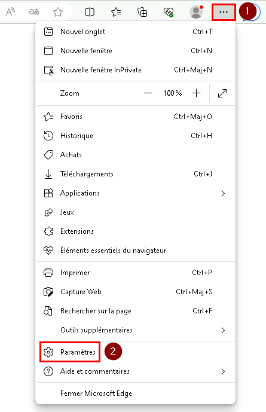

Dans l'onglet Confidentialité, j'ai désactivé SmartScreen et le blocage des applications potentiellement indésirables.

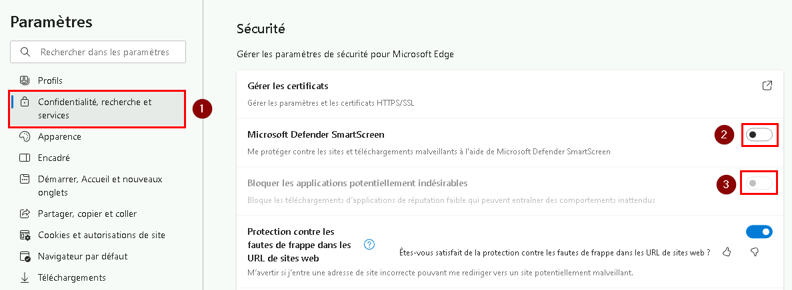

J'ai simulé le téléchargement d'une PUA sur le site de test AMTSo.


Le navigateur m'a averti du danger potentiel du fichier `.exe`, mais m'a permis de forcer sa conservation.

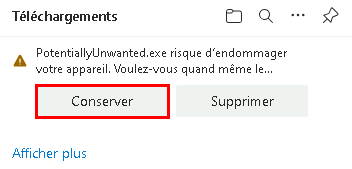

J'ai exécuté le programme PUA simulé.

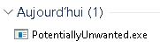

Le programme s'est exécuté avec succès (pop-ups d'installation), confirmant la vulnérabilité du poste si la protection n'est pas active.

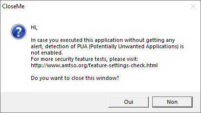

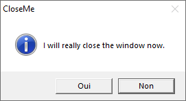

J'ai ensuite réactivé les protections dans Edge.

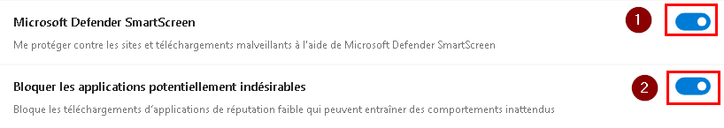

J'ai relancé le test de téléchargement AMTSo.

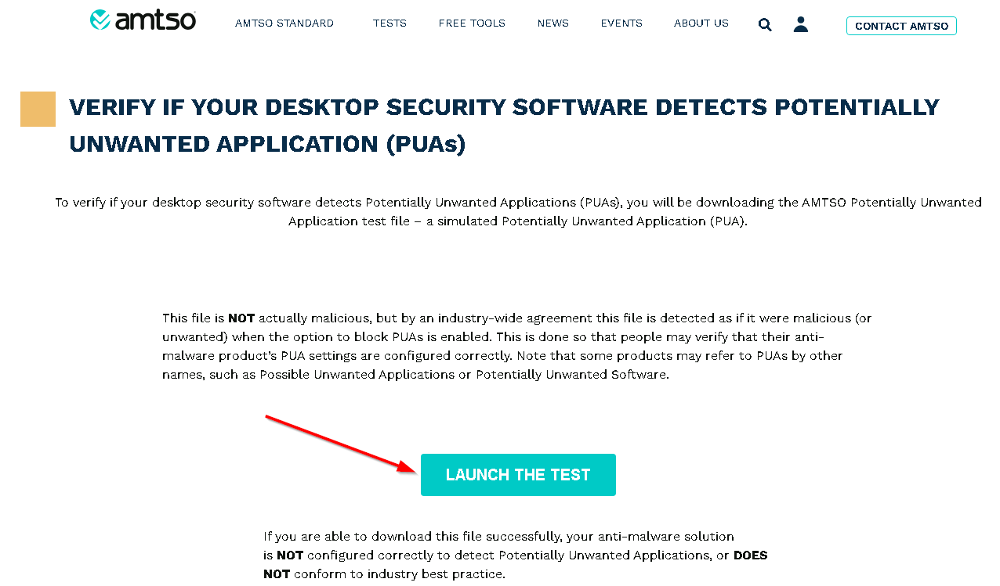

Cette fois-ci, le téléchargement de la PUA a été fermement et automatiquement bloqué par le système.

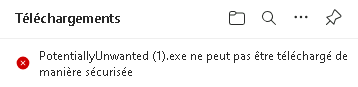

## 7. Protection réseau

**Contexte SOC / Blue Team :** La "Network Protection" étend les capacités de blocage de SmartScreen à tout le système d'exploitation, et non plus seulement au navigateur Edge. Si un script PowerShell, un document Word malveillant ou un autre navigateur tente de joindre un domaine C&C, la couche réseau bloquera l'initiative.

J'ai activé cette fonctionnalité via PowerShell en tant qu'administrateur.

J'ai utilisé la commande : 
```powershell
`Set-MpPreference -EnableNetworkProtection Enabled`
```

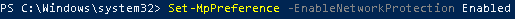

Pour montrer la méthode alternative, j'ai vérifié la stratégie GPO dans `Microsoft Defender Exploit Guard > Protection du réseau`.

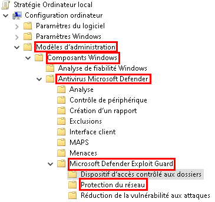

J'ai ouvert la stratégie "Empêcher les utilisateurs et les applications d'accéder à des sites Web dangereux".

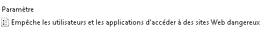

J'ai configuré la stratégie sur Activé avec l'option Refuser.

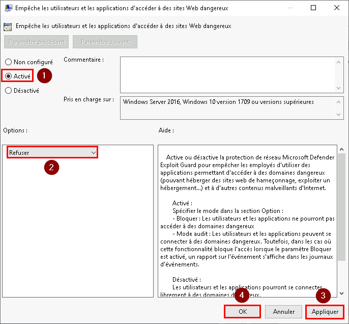

J'ai testé le blocage avec un navigateur tiers (Firefox). La page a été techniquement bloquée au niveau de l'OS, déclenchant une notification de sécurité système globale.

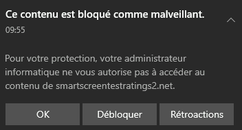

## 8. Exploit Protection

**Contexte SOC / Blue Team :** Pour empêcher l'exploitation des failles mémoires (Buffer Overflow, exécution de code arbitraire), WDEG propose l'Exploit Protection (EP). Il applique des défenses structurelles (ASLR, DEP, CFG) au niveau du système et au niveau granulaire pour chaque application. Un SOC préférera toujours faire crasher une application vulnérable attaquée (Déni de service localisé) plutôt que de laisser l'exploit s'exécuter.

### 8.1 Importation des paramètres via PowerShell
Pour appliquer une politique standardisée, j'ai utilisé un fichier XML généré en amont (ex: `ProcessMitigation.xml`).

J'ai ouvert PowerShell en administrateur et j'ai navigué vers le dossier contenant le fichier XML de configuration (ici, le dossier Downloads).

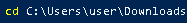

J'ai appliqué les paramètres avec la commande :
```powershell
`Set-ProcessMitigation -PolicyFilePath ProcessMitigation.xml`
```
Puis, j'ai vérifié que les paramètres étaient bien appliqués via la commande :
```powershell
`Get-ProcessMitigation`.
```

### 8.2 Visualisation et verrouillage via l'Interface Graphique
Il est possible de configurer tout cela depuis l'interface graphique. Je me suis rendu dans le menu "Sécurité Windows".


J'ai ouvert l'onglet "Contrôle des applications et du navigateur".

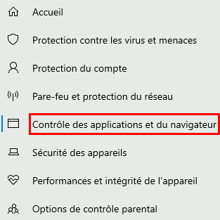

J'ai sélectionné "Paramètres d'Exploit protection".

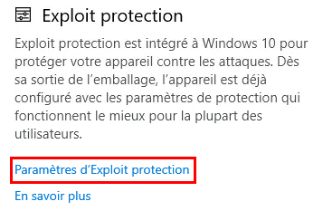

Dans cette vue, j'ai pu vérifier les paramètres système appliqués par défaut.

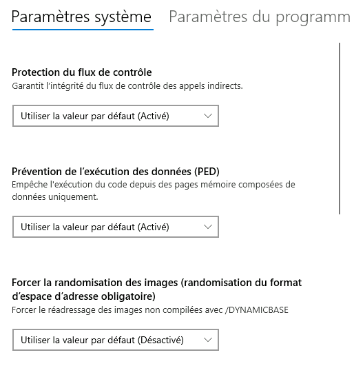

Dans l'onglet "Paramètres du programme", j'ai pu visualiser les paramètres spécifiques à certains exécutables (ici `Acrobat.exe`).

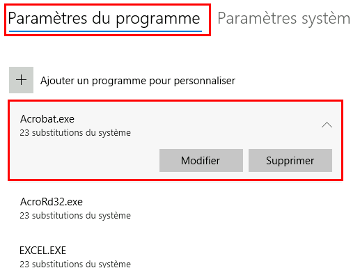

Voici une comparaison directe entre les données retournées par PowerShell et l'interface graphique.

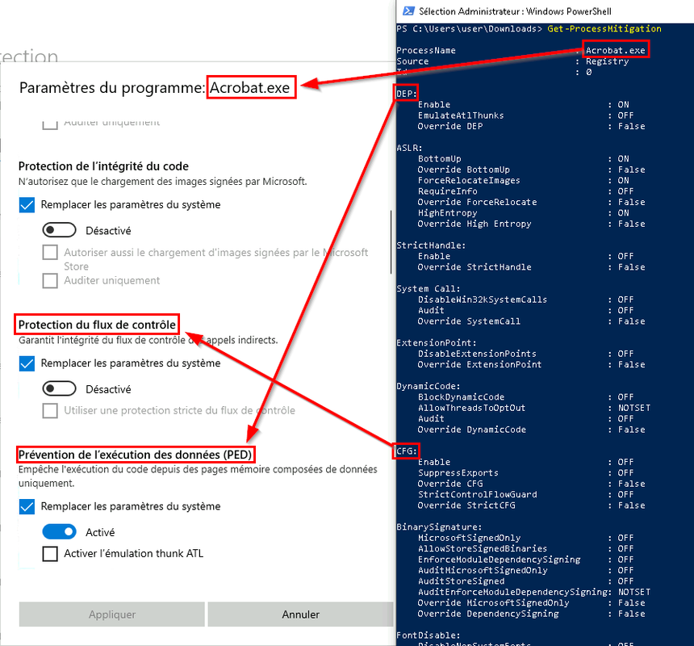

Pour éviter qu'un utilisateur ou un malware ne modifie ces paramètres critiques, il est impératif de verrouiller cette interface via GPO dans `Computer Configuration > Policies > Administrative Templates > Windows Components > Windows Security > App and browser protection`.

J'ai activé la stratégie "Empêcher les utilisateurs de modifier les paramètres".

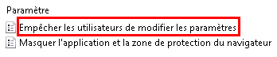

Suite à l'application de cette stratégie, les paramètres dans l'interface de Sécurité Windows sont devenus grisés et non modifiables.


# Implications pour un Analyste SOC
La mise en place de Windows Defender Exploit Guard marque la transition entre une sécurité passive (antivirus classique) et une posture de défense active. En tant qu'analyste Blue Team, l'application de ces règles me permet de "casser" la chaîne d'attaque (Kill Chain) dès les premières étapes : je bloque les macros suspectes via l'ASR, je coupe les communications C&C grâce à la Network Protection, et je rends les ransomwares inopérants avec l'accès contrôlé aux dossiers (CFA). Ce durcissement extrême ne se contente pas de bloquer les attaques "Zero-Day" et les malwares "Fileless" ; il génère également des journaux d'événements de très haute fidélité (Event Logs), me fournissant des alertes claires, sans le bruit habituel des faux positifs, pour déclencher mes investigations.

# Point d'attention SOC : Déploiement et Télémétrie (Event IDs)

Le Mode Audit : Dans un environnement de production réel, l'activation immédiate des règles ASR ou du CFA en mode "Blocage" risque de paralyser des applications métiers légitimes. La pratique standard d'un SOC consiste à déployer ces règles en Mode Audit dans un premier temps. Cela permet d'observer silencieusement le comportement du parc informatique.

Supervision SIEM : Le mode Audit génère de la télémétrie spécifique, notamment l'Event ID 1122 (Audit ASR) et l'Event ID 1124 (Audit CFA). Une fois les faux positifs identifiés et exclus, les règles sont basculées en mode Blocage, déclenchant alors des alertes de haute fidélité via l'Event ID 1121 (Blocage ASR) et l'Event ID 1123 (Blocage CFA). Ces numéros d'événements sont les points d'entrée de toute requête de Threat Hunting dans le SIEM.

---
*Fin du rapport de Lab.*