# Hardening de l'authentification Windows via GPO.

**Environnement :** Lab virtuel de Windows Hardening sur l'authentification et les comptes — Formation Analyste SOC - CyberUniversity (Liora x Sorbonne).

# Objectif du Lab
L'objectif de ce laboratoire est de durcir les politiques d'authentification et la gestion des comptes sur un système Windows. Par l'application stricte de Stratégies de Groupe (GPO), je vise à bloquer les vecteurs d'attaques courants liés aux identifiants (force brute, énumération, extraction de mots de passe en cache) et à réduire drastiquement la surface d'attaque lors de la connexion.

# Outils et Technologies Utilisées
* Système d'exploitation Windows 10/11.
* Éditeur de Stratégie de Groupe locale (gpedit.msc).
* Modèles d'administration supplémentaires de sécurité Microsoft (SecGuide).

# Contenus du Lab

## 1. Politique d'Authentification

**Contexte SOC / Blue Team :** L'utilisation de mots de passe faibles ou de méthodes de connexion alternatives dites "conviviales" facilite grandement le travail des attaquants lors de tentatives de force brute ou d'observation. Mon objectif défensif est d'imposer une barrière cryptographique robuste à la création des mots de passe et de désactiver les mécanismes d'authentification vulnérables.

**Démarche et Configurations :**
J'ai commencé par ouvrir l'éditeur de stratégie locale.
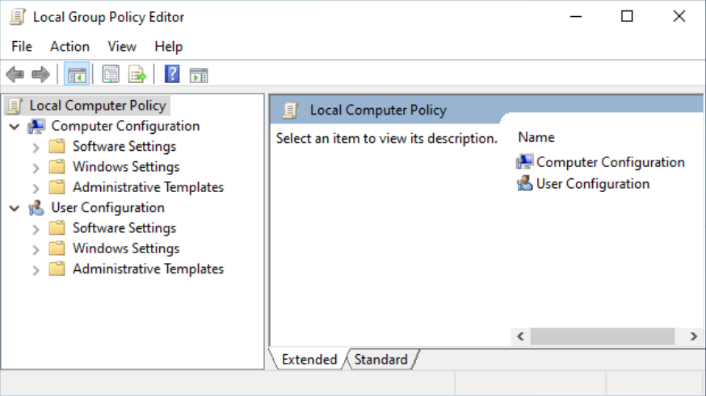

Je me suis rendu dans le chemin : `Configuration ordinateur > Modèles d'administration > Système > Ouverture de session`.

* **Stratégie :** Désactiver la connexion par mot de passe image.
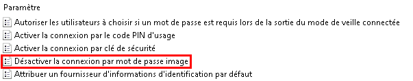
  * **Configuration :** Activé.
  * **Explications :** Les schémas visuels sont prévisibles, peu complexes et extrêmement vulnérables à la surveillance physique (shoulder surfing). Je force son interdiction.

* **Stratégie :** `Turn on convenience PIN sign-in`.
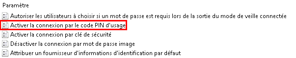
  * **Configuration :** Désactivé.
  * **Explications :** J'empêche l'utilisation d'un simple code PIN, souvent trop court et sujet aux attaques par dictionnaire, pour l'authentification au domaine.

Ensuite, j'ai configuré la robustesse des mots de passe via le chemin : `Configuration ordinateur > Paramètres Windows > Paramètres de sécurité > Stratégies de comptes > Stratégie de mot de passe`.

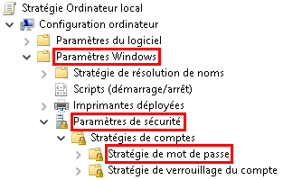

* **Stratégie :** `Maximum password age`.
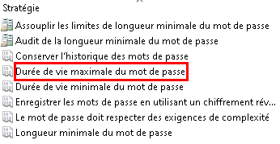
  * **Configuration :** 365 jours.
  * **Explications :** Un changement trop fréquent incite les utilisateurs à inscrire leurs mots de passe sur des post-it ou à utiliser des itérations prévisibles. Une rotation annuelle est un bon compromis pour un compte standard.

  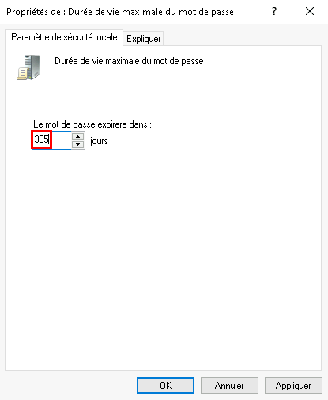

* **Stratégie :** `Minimum password length`.
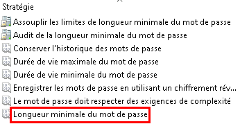
  * **Configuration :** 14 caractères.
  * **Explications :** La longueur est notre meilleure arme contre le cassage de condensats (hash). 14 caractères rendent les attaques par force brute mathématiquement inefficaces.
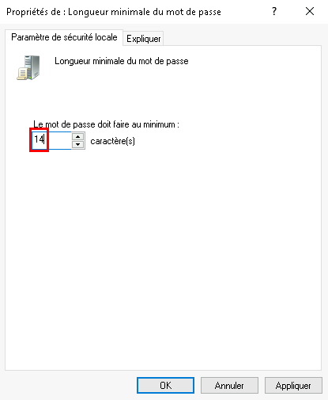

* **Stratégie :** `Password must meet complexity requirements`.
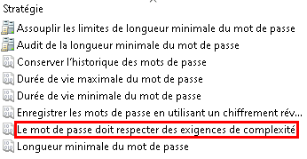
  * **Configuration :** Activé.
  * **Explications :** J'oblige l'utilisation d'au moins 3 types de caractères (majuscules, minuscules, chiffres, spéciaux) et j'interdis l'intégration du nom d'utilisateur dans le mot de passe.

* **Stratégie :** `Store passwords using reversible encryption`.
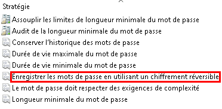
  * **Configuration :** Désactivé.
  * **Explications :** Le chiffrement réversible équivaut à un stockage en clair. C'est une vulnérabilité critique que je désactive impérativement.

Pour finaliser cette partie, je me suis rendu dans `Configuration ordinateur > Paramètres Windows > Paramètres de sécurité > Stratégies locales > Options de sécurité`.
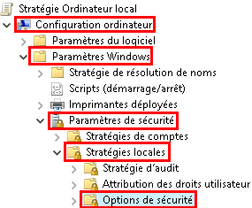

* **Stratégie :** `Accounts: Limit local account use of blank passwords to console logon only`.
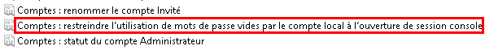
  * **Configuration :** Activé.
  * **Explications :** Les comptes sans mot de passe ne pourront s'authentifier que physiquement sur la machine, bloquant tout accès réseau non autorisé.

## 2. Verrouillage de Session

**Contexte SOC / Blue Team :** Un poste laissé déverrouillé sans surveillance est une faille critique. Un attaquant physique peut y exfiltrer des données ou implanter une persistance en quelques secondes. Mon approche consiste à automatiser le verrouillage de l'écran et à purger ce dernier de toute information potentiellement utile à la reconnaissance (OSINT).

**Démarche et Configurations :**
Chemin : `Configuration ordinateur > Modèles d'administration > Panneau de configuration > Personnalisation`.

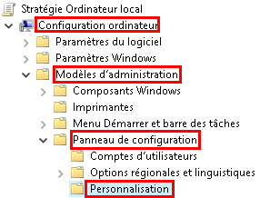

* **Stratégie :** `Prevent enabling lock screen camera`.
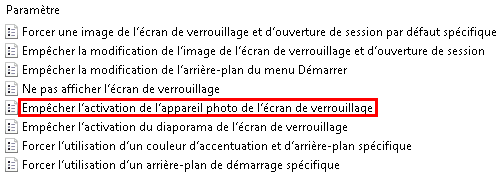
  * **Configuration :** Activé (Désactive l'accès caméra depuis l'écran de verrouillage).

* **Stratégie :** `Prevent enabling lock screen slide show`.
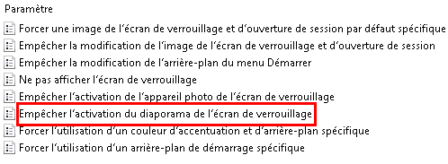
  * **Configuration :** Activé (Désactive le diaporama pour éviter la fuite visuelle d'informations).

Chemin : `Configuration ordinateur > Modèles d'administration > Système > Ouverture de session`.

* **Stratégie :** `Allow users to select when a password is required when resuming from connected standby`.
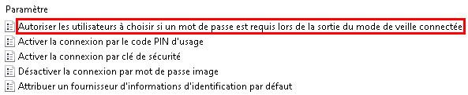
  * **Configuration :** Désactivé.

* **Stratégie :** `Turn off app notifications on the lock screen`.
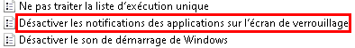
  * **Configuration :** Activé.
  * **Explications :** J'empêche l'affichage de notifications qui pourraient divulguer des données professionnelles ou des emails à une personne regardant l'écran verrouillé.

Chemin : `Configuration ordinateur > Modèles d'administration > Composants Windows > Explorateur de fichiers`.

* **Stratégie :** `Show lock in the user tile menu`.
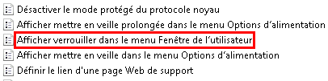
  * **Configuration :** Activé.

Chemin : `Configuration ordinateur > Modèles d'administration > Composants Windows > Windows Ink Workspace`.

* **Stratégie :** `Allow Windows Ink Workspace`.
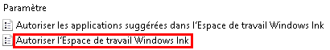
  * **Configuration :** Désactivé (ou autorisé uniquement si déverrouillé).

  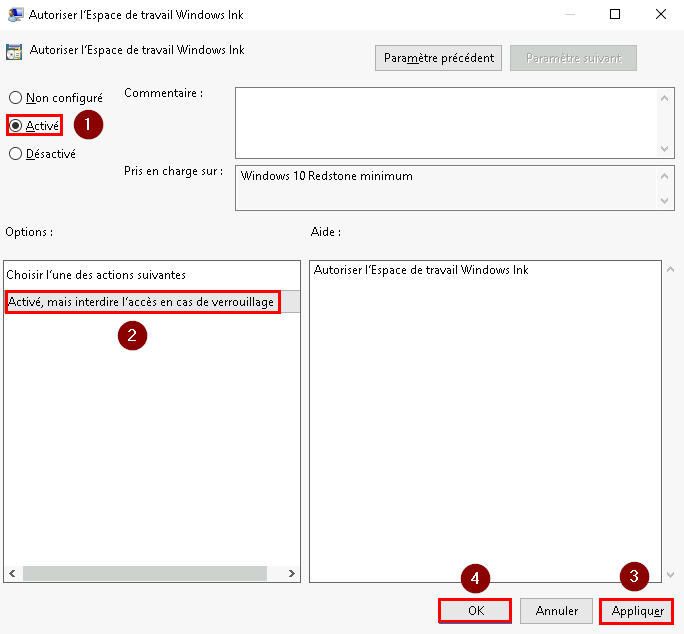

Chemin : `Configuration ordinateur > Paramètres Windows > Paramètres de sécurité > Stratégies locales > Options de sécurité`.

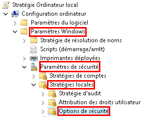

* **Stratégie :** `Interactive logon: Machine inactivity limit`.
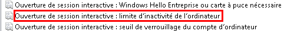
  * **Configuration :** 900 secondes (15 minutes).
  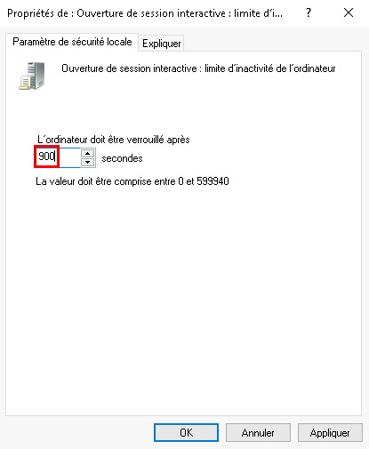
  * **Explications :** Définit le seuil d'inactivité avant le déclenchement de l'écran de veille et le verrouillage de la session.

Chemin : `Configuration utilisateur > Modèles d'administration > Panneau de configuration > Personnalisation`.

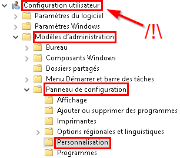

* **Stratégie :** `Enable screen saver`.
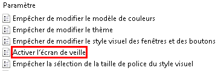
  * **Configuration :** Activé.

* **Stratégie :** `Password protect the screen saver`.
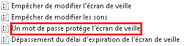
  * **Configuration :** Activé (Impose la saisie du mot de passe au retour).

* **Stratégie :** `Screen saver timeout`.
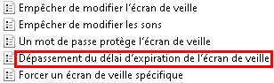
  * **Configuration :** 900 secondes.
  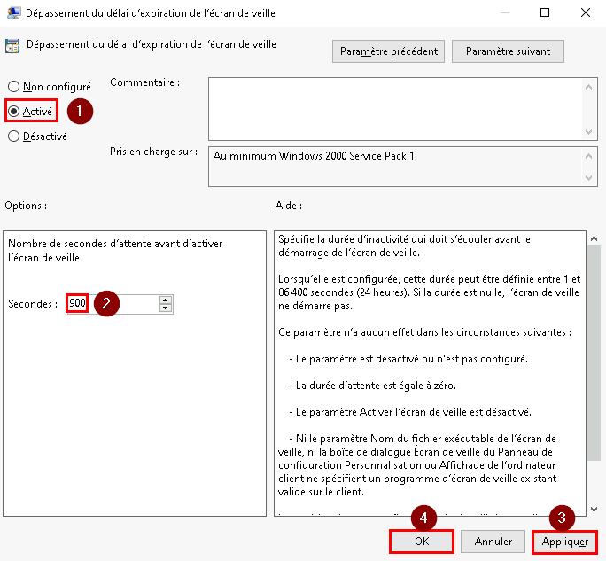

Chemin : `Configuration utilisateur > Modèles d'administration > Menu Démarrer et barre des tâches > Notifications`.

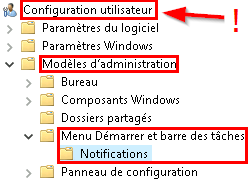

* **Stratégie :** `Turn off toast notifications on the lock screen`.
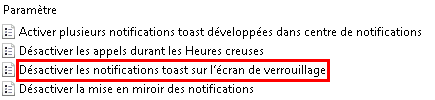
  * **Configuration :** Activé.

Chemin : `Configuration utilisateur > Modèles d'administration > Composants Windows > Contenu Cloud`.

* **Stratégie :** `Do not suggest third-party content in Windows spotlight`.
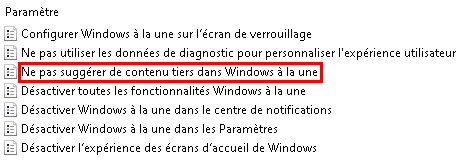
  * **Configuration :** Activé.

## 3. Stratégie de Verrouillage de Compte

**Contexte SOC / Blue Team :** L'automatisation des attaques d'authentification (Password Spraying, Bruteforce) rend les mots de passe vulnérables s'il n'y a pas de limite d'essais. En configurant un seuil de verrouillage, je ralentis considérablement l'attaquant et je génère du bruit (logs d'échecs critiques) facilement détectable par le SOC.

**Démarche et Configurations :**
Chemin : `Configuration ordinateur > Paramètres Windows > Paramètres de sécurité > Stratégies de comptes > Stratégie de verrouillage du compte`.

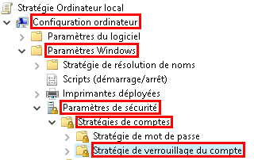

* **Stratégie :** `Account lockout threshold`.
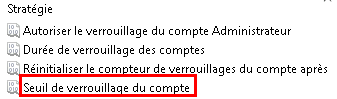
  * **Configuration :** 5 tentatives.
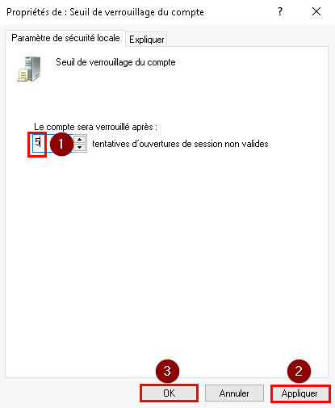
  * **Explications :** Un seuil à 5 permet d'absorber les erreurs de frappe légitimes de l'utilisateur tout en bloquant rapidement les scripts malveillants.

* **Stratégie :** `Account lockout duration`.
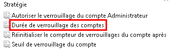
  * **Configuration :** 0 minute.
  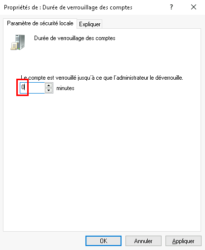
  * **Explications :** La valeur "0" indique que le compte restera verrouillé définitivement jusqu'à l'intervention d'un administrateur.

* **Stratégie :** `Reset account lockout counter after`.
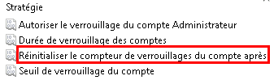
  * **Configuration :** 15 minutes.
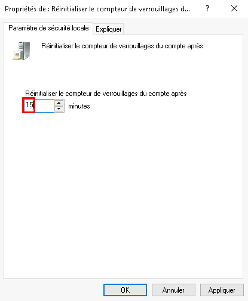

## 4. Mise en Cache des Informations d'Identification

**Contexte SOC / Blue Team :** Windows met en cache les informations d'identification dans la mémoire (LSASS) ou la base SAM pour permettre des connexions hors ligne. Ces caches sont la cible prioritaire d'outils comme Mimikatz. Mon but est de réduire la taille de ce cache et d'activer des solutions de virtualisation pour isoler ces secrets du noyau.

**Démarche et Configurations :**
Chemin : `Configuration ordinateur > Paramètres Windows > Paramètres de sécurité > Stratégies locales > Options de sécurité`.

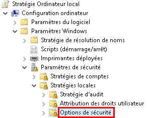

* **Stratégie :** `Interactive logon: Number of previous logons to cache`.
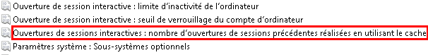
  * **Configuration :** 1 ou 2.
  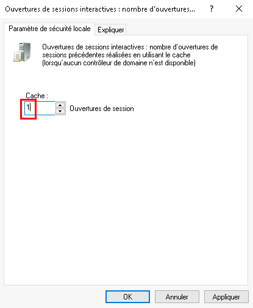
  * **Explications :** En limitant le cache aux toutes dernières connexions, je réduis l'impact d'une compromission de la base SAM locale.

* **Stratégie :** `Network access: Do not allow storage of passwords and credentials for network authentication`.
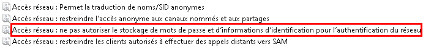
  * **Configuration :** Activé.

**Désactivation de WDigest et intégration de Credential Guard :**
Pour désactiver WDigest (qui stocke les mots de passe en clair dans la mémoire), j'ai dû télécharger les modèles d'administration SecGuide depuis le site de Microsoft.
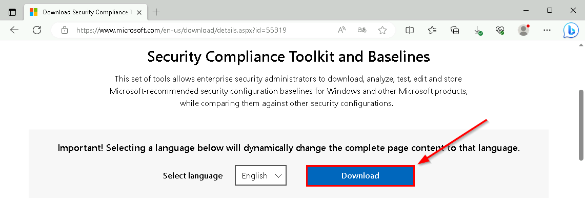

Sélection de la version adaptée et le télécharger.
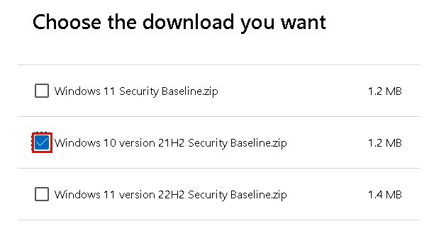

Décompression de l'archive.

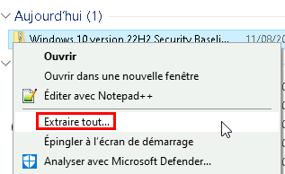

Navigation vers le dossier "Templates".
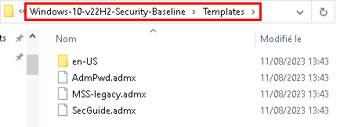

Copie du fichier SecGuide.admx dans le répertoire `%SystemRoot%\PolicyDefinitions`.
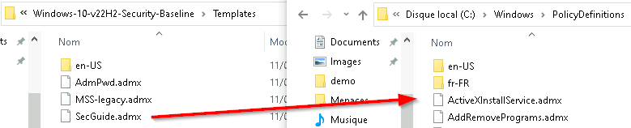

Copie du fichier SecGuide.adml dans le répertoire `%SystemRoot%\PolicyDefinitions\en-Us`.
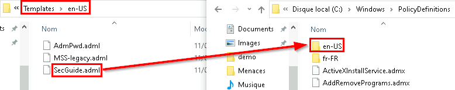

Le chemin `Configuration ordinateur > Modèles d'administration > MS Security Guide` est maintenant disponible.
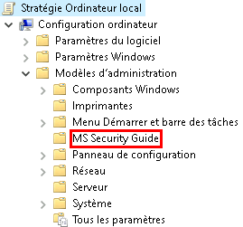

* **Stratégie :** `WDigest Authentication`.
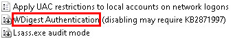
  * **Configuration :** Désactivé.

Chemin : `Configuration ordinateur > Modèles d'administration > Système > Device Guard`.

* **Stratégie :** `Turn On Virtualization Based Security`.

  * **Configuration :** Activé.
  * **Explications :** J'applique des protections de mémoire en mode noyau pour sécuriser le processus LSASS.
  

## 5. Saisie des Identifiants

**Contexte SOC / Blue Team :** L'étape de saisie est vulnérable aux enregistreurs de frappe (Keyloggers) et à l'énumération visuelle. En tant que défenseur, j'impose l'utilisation du "Secure Desktop" (chemin approuvé) et je masque toute information système (noms de comptes, sélecteur de réseau) sur l'écran d'accueil pour priver l'attaquant de renseignements préliminaires.

**Démarche et Configurations :**
Chemin : `Configuration ordinateur > Modèles d'administration > Système > Ouverture de session`.

* **Stratégie :** `Do not display network selection UI`.

  * **Configuration :** Activé.

* **Stratégie :** `Enumerate local users on domain-joined computers`.

  * **Configuration :** Désactivé.

Chemin : `Configuration ordinateur > Modèles d'administration > Composants Windows > Credential User Interface`.

* **Stratégie :** `Do not display the password reveal button`.

  * **Configuration :** Activé (Désactive l'icône de l'œil).

* **Stratégie :** `Enumerate administrator accounts on elevation`.

  * **Configuration :** Désactivé.
  * **Explications :** Lors d'une demande UAC, le nom de l'administrateur n'est plus proposé par défaut. L'attaquant doit le deviner.

* **Stratégie :** `Require trusted path for credential entry`.

  * **Configuration :** Activé.

* **Stratégie :** `Prevent the use of security questions for local accounts`.

  * **Configuration :** Activé.
  * **Explications :** Les réponses de sécurité sont facilement repérables via des recherches en sources ouvertes (OSINT).

Chemin : `Configuration ordinateur > Modèles d'administration > Composants Windows > Options d'ouverture de session Windows`.

* **Stratégie :** `Disable or enable software Secure Attention Sequence`.

  * **Configuration :** Désactivé.

* **Stratégie :** `Sign-in last interactive user automatically after a system-initiated restart`.

  * **Configuration :** Désactivé.

Chemin : `Configuration ordinateur > Paramètres Windows > Paramètres de sécurité > Stratégies locales > Options de sécurité`.

* **Stratégie :** `Interactive logon: Do not require CTRL+ALT+DEL`.

  * **Configuration :** Désactivé.
  * **Explications :** En désactivant cette exception, j'oblige l'utilisateur à effectuer Ctrl+Alt+Suppr, garantissant qu'il interagit avec l'invite d'authentification authentique de l'OS et non avec un programme de spoofing.

## 6. Connexions Anonymes

**Contexte SOC / Blue Team :** Historiquement, Windows autorise certaines requêtes réseau anonymes. C'est un vecteur de choix lors de la phase de reconnaissance réseau pour un attaquant souhaitant énumérer les comptes, les SID et les partages. J'applique un blocage strict de toute forme de connexion ou d'énumération anonyme.

**Démarche et Configurations :**
Chemin : `Configuration ordinateur > Modèles d'administration > Réseau > Station de travail Lanman`.

* **Stratégie :** `Enable insecure guest logons`.

  * **Configuration :** Désactivé.

Chemin : `Configuration ordinateur > Paramètres Windows > Paramètres de sécurité > Stratégies locales > Options de sécurité`.

* **Stratégie :** `Network access: Allow anonymous SID/Name translation`.

  * **Configuration :** Désactivé.

* **Stratégie :** `Network access: Do not allow anonymous enumeration of SAM accounts`.

  * **Configuration :** Activé.

* **Stratégie :** `Network access: Let Everyone permissions apply to anonymous users`.

  * **Configuration :** Désactivé.

* **Stratégie :** `Network access: Restrict anonymous access to Named Pipes and Shares`.

  * **Configuration :** Activé.

* **Stratégie :** `Network access: Restrict clients allowed to make remote calls to SAM`.

  * **Configuration :** Restreindre la sécurité.

    Sélectionner "Modifier la sécurité"

    Application des paramètres.

* **Stratégie :** `Network security: Allow Local System to use computer identity for NTLM`.

  * **Configuration :** Activé.

* **Stratégie :** `Network security: Allow LocalSystem NULL session fallback`.

  * **Configuration :** Désactivé.

Chemin : `Configuration ordinateur > Paramètres Windows > Paramètres de sécurité > Stratégies locales > Attribution des droits utilisateur`.

* **Stratégie :** `Access this computer from the network`.

  * **Configuration :** Ne conserver que les groupes/utilisateurs strictement nécessaires.
  

* **Stratégie :** `Deny access to this computer from the network`.

  * **Configuration :** Ajouter explicitement les comptes locaux qui ne doivent faire l'objet d'aucun accès réseau distant.
  

## 7. Hachage LM

**Contexte SOC / Blue Team :** Le hachage LAN Manager (LM) est une antiquité cryptographique extrêmement faible, cassable en quelques instants. Je dois m'assurer que le système ne stocke plus aucune empreinte sous ce format de rétrocompatibilité.

**Démarche et Configurations :**
Chemin : `Configuration ordinateur > Paramètres Windows > Paramètres de sécurité > Stratégies locales > Options de sécurité`.

* **Stratégie :** `Network security: Do not store LAN Manager hash value on next password change`.

  * **Configuration :** Activé.
  * **Explications :** Enlève la capacité de Windows à générer des hash LM. L'utilisateur devra changer son mot de passe actuel pour que cette règle d'hygiène devienne effective et purge l'ancien hash LM du système.

# Implications pour un Analyste SOC
La compromission d'identifiants représente la phase d'accès initial ou d'élévation de privilèges la plus critique dans la Cyber Kill Chain. À travers ce laboratoire, j'ai appliqué un principe de défense en profondeur sur l'authentification locale et réseau. J'ai restreint l'accumulation d'artefacts en mémoire (cache LSASS, hachages LM) qui alimentent le déplacement latéral des attaquants. J'ai également généré un environnement propice à la détection pour mon équipe SOC : le verrouillage des comptes par force brute va produire des journaux d'événements nets et exploitables, bloquant l'attaquant tout en alertant les analystes. La minimisation des informations sur l'écran d'accueil et le blocage des connexions anonymes compliquent considérablement l'étape de reconnaissance (Discovery) pour les menaces internes ou physiques.

### Perspectives d'amélioration et Visibilité SOC :

**Gestion des Administrateurs Locaux (LAPS) :** Bien que les stratégies de mots de passe soient durcies, le risque de mouvement latéral (Pass-the-Hash / Pass-the-Password) persiste si le mot de passe du compte Administrateur local est identique sur tout le parc. Pour éviter cette configuration, le déploiement de la solution Microsoft LAPS (Local Administrator Password Solution) est indispensable afin de randomiser, faire tourner et stocker ces mots de passe de manière sécurisée dans l'Active Directory.

**Politiques d'Audit (Event Logs) :** Les règles de verrouillage définies dans ce laboratoire ne sont utiles au SOC que si elles génèrent des alertes. Il est impératif d'accompagner ces GPO par l'activation stricte des stratégies d'audit avancées (notamment Audit Logon et Audit Credential Validation). Cela garantit la génération et la remontée des Event ID 4624 (Connexion réussie) et Event ID 4625 (Échec de connexion) vers le SIEM pour la détection des attaques par force brute ou Password Spraying.

---
*Fin du rapport de Lab.*