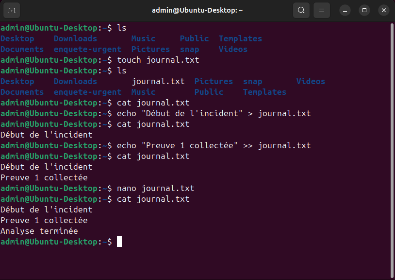
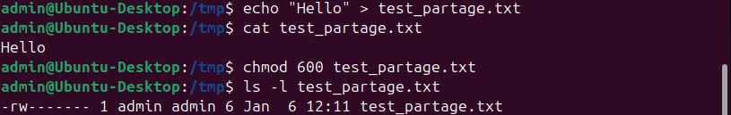
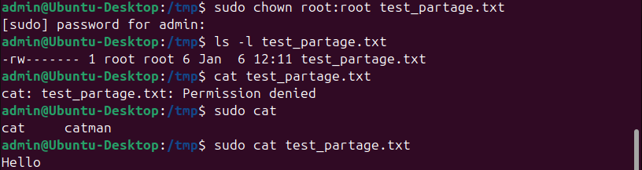
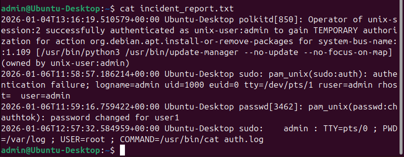
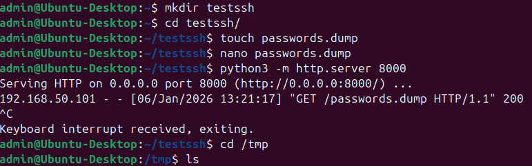

## Missions Pratiques (Home Lab)

Exercices réalisés sur mon environnement virtuel (Ubuntu/Kali) pour valider les compétences SOC.

 ### ✅ Mission 1 : Navigation, Flags & Opérateurs Logiques (Validée)
* **Objectif :** Maîtriser l'automatisation simple et la visibilité.
* **Commandes exécutées :**
    1.  `ls -la` (Liste tout, y compris les fichiers cachés `.`).
    2.  `mkdir Enquete_Urgent && cd Enquete_Urgent` (Création et déplacement en une fois).
    3.  `pwd` (Validation du chemin absolu).
* **Résultat obtenu :** Le terminal affiche le contenu complet du dossier home, puis confirme le déplacement immédiat dans `/home/admin/Enquete_Urgent`.

### ✅ Mission 2 : Manipulation de Texte & Redirections (Validée)
* **Objectif :** Créer et modifier des rapports d'incident sans interface graphique.
* **Commandes exécutées :**
    1.  `echo "Début de l'incident" > journal.txt` (Création du fichier avec contenu initial).
    2.  `echo "Preuve 1 collectée" >> journal.txt` (Ajout à la suite sans écraser).
    3.  `nano journal.txt` (Édition manuelle pour ajouter la ligne de conclusion).
    4.  `cat journal.txt` (Affichage final pour validation).
* **Preuve de réussite :**
    
    *(Le fichier contient bien les 3 lignes chronologiques).*

### ✅ Mission 3 : Gestion des Droits, Isolation & Chmod (Validée)
* **Objectif :** Simuler un scénario multi-utilisateurs pour comprendre les risques de lecture ("World Readable") et sécuriser un fichier sensible.
* **Commandes exécutées :**

    1.  **Préparation :** Création d'un utilisateur tiers (`sudo adduser user1`) pour servir de "témoin".

    2.  **Test Système & Création :**
        * Tentative de création dans `/etc` -> **Échec** (Protection système).
        * Création de `test_partage.txt` dans `/tmp` -> **Succès**.
        

    3.  **Test de Vulnérabilité (User1) :**
        * Connexion avec `su - user1`.
        * Tentative de suppression -> **Échec** (Sticky bit sur /tmp).
        * Tentative de lecture -> **Succès** (Par défaut, les fichiers sont lisibles par tous).
        * Tentative d'écriture -> **Échec** (Pas de permissions).
        

    4.  **Durcissement (Admin) :**
        * Ajout de contenu sensible ("Hello").
        * Application du **Moindre Privilège** : `chmod 600 test_partage.txt` (Lecture/Écriture pour le propriétaire uniquement).
        * Vérification avec `ls -l` : Les droits sont passés de `-rw-rw-r--` à `-rw-------`.
        

    5.  **Verrouillage Final avec chown (Admin) :**
        * Transfert à Root : `sudo chown root:root test_partage.txt`.
        * Test d'accès admin : `cat test_partage.txt` -> **Permission Denied** (Même l'admin est bloqué !).
        * C'est la protection maximale.
        * Avec sudo ça marche (sudo = root).
        

    6.  **Validation Finale (User1) :**
        * Nouvelle tentative de lecture par `user1`.
        * Résultat : **Permission denied**. Le fichier est évidemment inaccessible par user1.
        

### ✅ Mission 4 : Processus & Background (Validée)
* **Objectif :** Gérer des tâches de fond et neutraliser un processus par son PID.
* **Commandes exécutées :**
    1.  `sleep 500 &` (Lancement en background pour ne pas bloquer le shell).
    2.  `ps aux | grep sleep` (Recherche du PID spécifique dans la liste des processus).
    3.  `kill 4064` (Arrêt forcé du processus via son PID).
    4.  `ps -p 4064` (Confirmation que le processus n'existe plus).
* **Preuve de réussite :**
    

### ✅ Mission 5 : Grep & Logs (Validée)
* **Objectif :** Extraire de l'information critique dans un fichier de log système (Compétence SOC n°1).
* **Commandes exécutées :**
    1.  **Extraction (Bypass Permission) :** `sudo cat /var/log/auth.log > ~/auth-test.log` (Copie du log système protégé vers le dossier utilisateur pour analyse).
    2.  **Comptage (Analysis) :** `cat auth-test.log | grep -a "auth" | wc -l` (Le pipe `|` envoie le résultat de grep vers `wc` qui compte les lignes).
    3.  **Rapport (Reporting) :** `cat auth-test.log | grep -a "auth" > incident_report.txt` (Redirection des lignes suspectes vers un fichier de preuve).
    4.  **Vérification :** `cat incident_report.txt`.
* **Preuve de réussite :**
    
    *(On voit bien le refus d'accès initial, puis la réussite de la copie et du grep).*
    
    
    *(Le rapport contient bien les logs filtrés).*

### ✅ Mission 6 : Réseau, Exfiltration & Troubleshooting SSH (Validée)
* **Objectif :** Simuler l'exfiltration de données (HTTP) et l'administration sécurisée (SCP) entre deux machines (Kali <-> Ubuntu).
* **Commandes exécutées :**
    
    1.  **Exfiltration de Données (Ubuntu -> Kali) :**
        * Sur Ubuntu : Exposition du dossier via `python3 -m http.server 8000`.
        * Sur Kali : Récupération via `wget http://[IP_Ubuntu]:8000/passwords.dump`.
        * *Risque démontré :* Transfert en clair, sans authentification.
        

    2.  **Configuration Système (Troubleshooting) :**
        * Le transfert SCP a initialement échoué car le service SSH était éteint.
        * **Remédiation :** `sudo systemctl start ssh` puis `enable ssh` pour la persistance.
        

    3.  **Transfert Sécurisé (Kali -> Ubuntu) :**
        * Création du script `patch_security.sh`.
        * Envoi sécurisé vers le dossier temporaire de la victime : `scp patch_security.sh admin@192.168.50.102:/tmp/`.
        

---
*Dernière mise à jour : Janvier 2026*