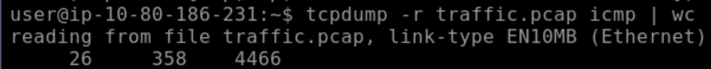
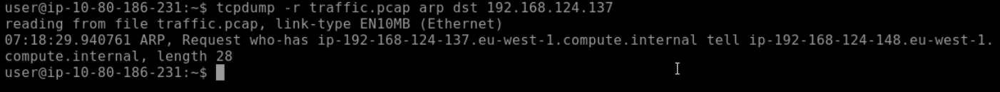
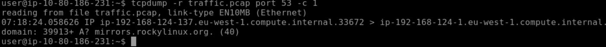
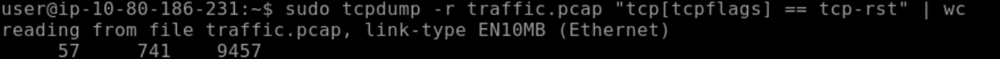
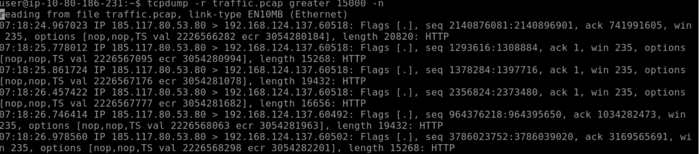

# Lab Pratique : Analyse Forensic avec Tcpdump

**Fichier de preuve :** `traffic.pcap`

**Objectif :** Extraire des indicateurs de compromission et analyser les comportements réseau suspects via CLI.

Ce laboratoire pratique détaille les commandes `tcpdump` utilisées pour isoler des événements spécifiques au sein d'une capture réseau dense.

---

## 1. Analyse Volumétrique (Protocoles)

L'une des premières étapes de l'analyse consiste à quantifier le trafic par protocole pour identifier des anomalies potentielles (ex: Tunneling ICMP).

**Objectif :** Compter le nombre total de paquets ICMP dans la capture.

```bash
tcpdump -r traffic.pcap icmp | wc
```
* **`-r`** : Lecture du fichier pcap.
* **`icmp`** : Filtre uniquement le protocole ICMP.
* **`| wc`** : Pipe vers `word count` pour obtenir un chiffre immédiat.



---

## 2. Analyse de la Couche Liaison (ARP & MAC)

Le protocole ARP est souvent ciblé pour des attaques de type "Spoofing". Il est crucial de pouvoir inspecter les adresses physiques (MAC) et les cibles des requêtes.

**Objectif A :** Identifier l'émetteur d'une requête ARP spécifique.
Nous cherchons ici la machine qui tente de résoudre l'adresse IP `192.168.124.137` .

```bash
tcpdump -r traffic.pcap arp dst 192.168.124.137
```
* **`arp`** : Filtre le protocole de résolution d'adresse.
* **`dst [IP]`** : Isole uniquement les paquets à destination de cette IP.



**Objectif B :** Extraire l'adresse MAC source d'une requête ARP.
Par défaut, Tcpdump n'affiche pas les en-têtes de liaison. L'option `-e` est nécessaire.

```bash
tcpdump -r traffic.pcap -e arp
```
* **`-e`** : Affiche l'en-tête de niveau lien (Ethernet), révélant les adresses MAC source et destination.


---

## 3. Analyse DNS (Noms de Domaine)

L'inspection DNS permet d'identifier les communications vers des domaines externes (C2 servers, téléchargements).

**Objectif :** Identifier le premier nom de domaine résolu dans la capture.

```bash
tcpdump -r traffic.pcap port 53 -c 1
```
* **`port 53`** : Filtre le trafic standard DNS (UDP/TCP).
* **`-c 1`** : S'arrête après le premier paquet trouvé, utile pour obtenir un échantillon rapide sans polluer le terminal.



---

## 4. Analyse Avancée (Flags TCP & Anomalies)

Pour détecter des scans de ports ou de l'exfiltration de données, il faut utiliser des filtres avancés sur les bits d'en-tête et la taille des paquets.

**Objectif A :** Détection de scans (Flags RST).
Un grand nombre de paquets `RST` (Reset) indique souvent des connexions refusées ou interrompues brutalement, typique d'un scan de port actif.

```bash
tcpdump -r traffic.pcap "tcp[tcpflags] == tcp-rst" | wc
```
* **`tcp[tcpflags]`** : Accède à l'octet contenant les drapeaux TCP.
* **`== tcp-rst`** : Vérifie si seul le bit RST est activé.



**Objectif B :** Détection d'exfiltration (Taille de paquet).
Des paquets anormalement volumineux peuvent indiquer un transfert de données non standard ou du tunneling.

```bash
tcpdump -r traffic.pcap greater 15000 -n
```
* **`greater 15000`** : Filtre les paquets dont la taille dépasse 15 000 octets.
* **`-n`** : Désactive la résolution DNS pour accélérer l'affichage.

