# SOC Analyst Simulator: Alert Triage, Classification, and Reporting

**Environment:** Virtual Lab - Tryhackme SOC Simulator "Introduction to Phishing".

## 1. Lab Overview & Environment
**Objective:** This lab focuses on the full lifecycle of alert triage, SIEM investigation, alert classification, and report writing within a simulated Security Operations Center (SOC). 

**Simulated Organization:** The Try Daily, an energetic publishing company.

**Tools & Data Sources:**
* **SIEM (Splunk):** Used to query and correlate ModSecurity Web Application Firewall (WAF) logs, Email logs, and network Firewall logs.
* **TryDetectThis:** A Threat Intelligence platform used to analyze and score URLs, IPs, and files for maliciousness.

## 2. SOC Methodology & Playbook
To maintain a standardized response, I followed a strict triage playbook:
1.  **Initial Review:** Assign the alert, understand the detection logic, and extract initial Indicators of Compromise (IOCs).
2.  **Investigation:** Query the SIEM to build a timeline of events and cross-reference IOCs against the TryDetectThis threat intelligence app.
3.  **Resolution:** Classify the alert as a True Positive (TP) or False Positive (FP), determine if escalation is required, and draft a comprehensive case report based on the 5Ws (Who, What, When, Where, Why).
* **Escalation Criteria:** Escalation is only required if further remediation is needed (e.g., a threat actor bypassed controls, or a successful unauthorized access occurred). If an attack was automatically blocked by a firewall or quarantined before impact, no escalation is needed.

---

## 3. Incident Investigations

### Alert 8816 - Access to Blacklisted External URL Blocked by Firewall
* **Severity:** High
* **Data Source:** Firewall
* **Timestamp:** 02/24/2026 11:20:36
* **Description:** This alert was triggered when a user attempted to access an external URL that is listed in the organization's blacklist or threat intelligence feeds. The firewall or proxy successfully blocked the outbound request, preventing the connection. Note: The blacklist only covers known threats. It does not guarantee protection against new or unknown malicious domains.

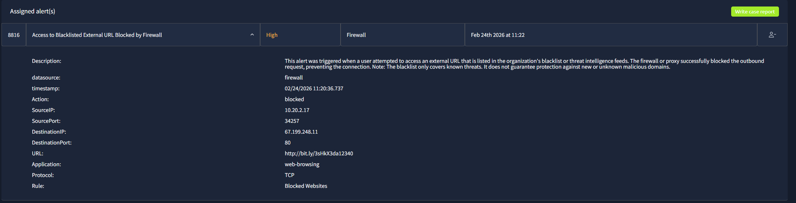

#### **Investigation:**

I started by reviewing the firewall logs in Splunk. 

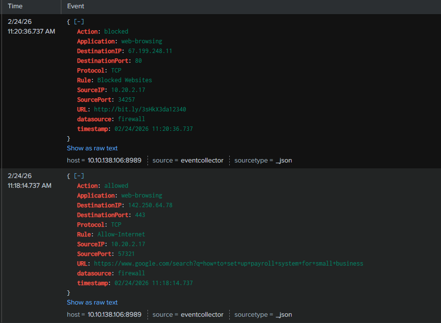

I identified that the Source IP 10.20.2.17 (belonging to employee Hannah Harris) attempted to connect to Destination IP ```67.199.248.11``` on port ```80```. The requested URL was a shortened link (```http://bit.ly/3sHkX3da12340```). I submitted this URL to the TryDetectThis app, which confirmed its status as malicious. 


The Splunk logs confirmed the action was "blocked" by the "Blocked Websites" rule.

**Classification & Escalation:**
* **Classification:** True Positive.
* **Escalation:** Not required, as the firewall successfully blocked the attempt.

**Analyst Report:**
This activity is classified as a True Positive due to the fact that the user Hannah Harris, from IP address ```10.20.2.17``` and port ```34257``` attempted to access an external URL (```http://bit.ly/3sHkX3da12340```) at destination IP ```67.199.248.11``` and port ```80```, that is listed in the organization's blacklist or threat intelligence feeds. This IP is flagged as malicious on the TryDetectThis App. The situation started at 11:20 on 02/24/2026. No escalation is required due to the fact that the firewall blocked the attempt.

**AI Feedback & Lessons Learned:**
The SOC Simulator AI noted that while my report was accurate, it could be improved by explicitly mentioning the *lack of business impact*, such as data loss or compromise, which is important to reassure stakeholders about the security posture. Also by specifying the exact firewall rule triggered, and including the affected user's email address for complete identification.

---

### Alert 8814 - Inbound Email Containing Suspicious External Link
* **Severity:** Medium
* **Data Source:** Email
* **Timestamp:** 02/24/2026 11:16:09
* **Description:** This alert was triggered by an inbound email containing one or more external links due to potentially suspicious characteristics. As part of the investigation, check firewall or proxy logs to determine whether any endpoints have attempted to access the URLs in the email and whether those connections were allowed or blocked.

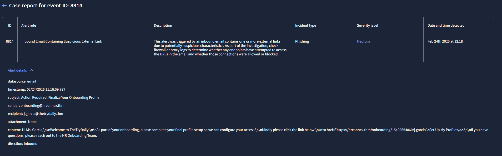

#### **Investigation:**

I analyzed the email logs for the message sent from ```onboarding@hrconnex```.thm to ```j.garcia@thetrydaily.thm``` (Julia Garcia) with the subject "Action Required: Finalize Your Onboarding Profile". 

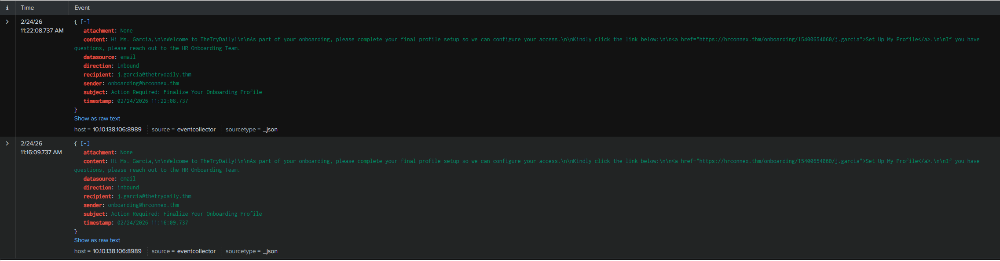

I extracted the sender domain and the embedded link (```https://hrconnex.thm/onboarding/15400654060/j.garcia```) and analyzed both in the TryDetectThis app.

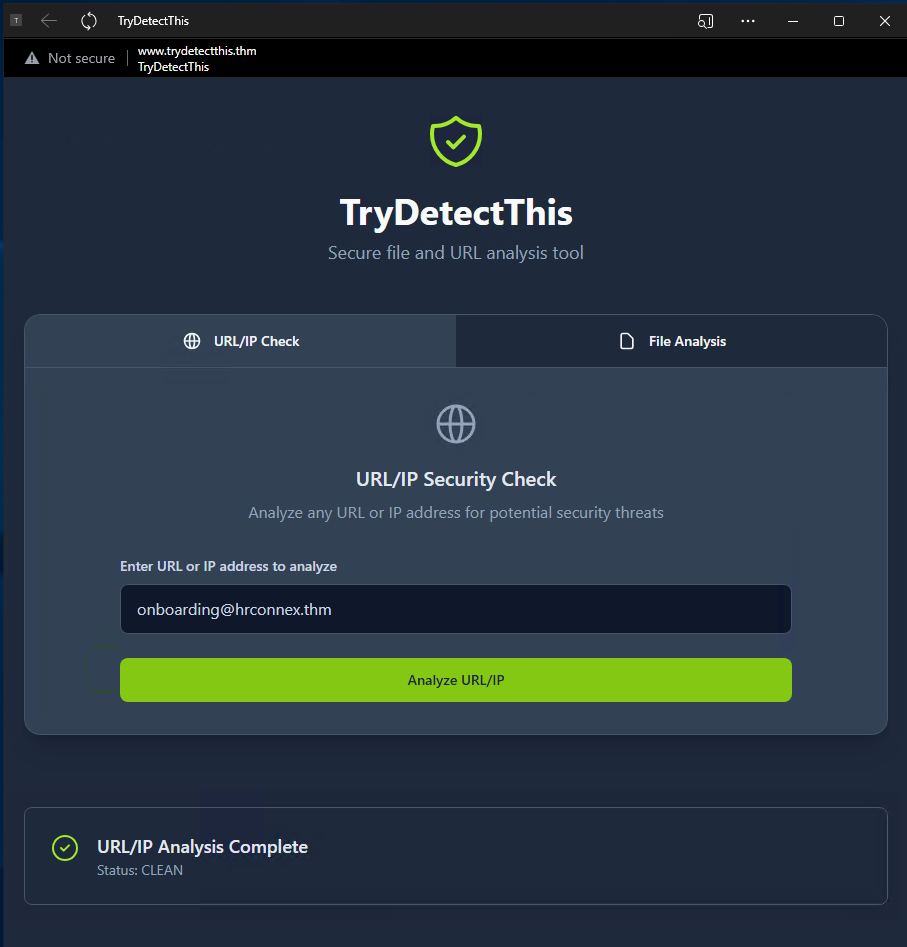

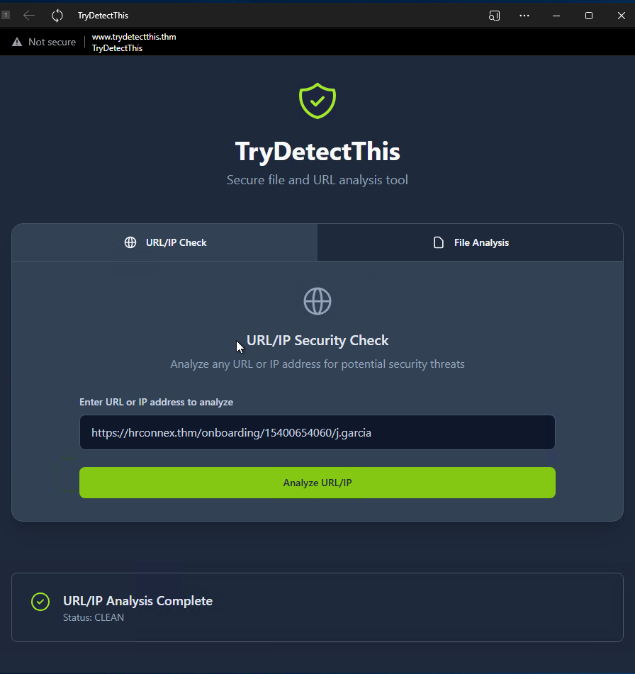

Both returned a "CLEAN" status. Furthermore, I cross-referenced the firewall logs and found no evidence that the user clicked the link or attempted a connection to that domain.

**Classification & Escalation:**
* **Classification:** False Positive.
* **Escalation:** Not required.

**Analyst Report:**
This activity is classified as a False Positive. I detected that at 11:16 on 02/24/2026 sender ```onboarding@hrconnex``` sent an email to recipient ```j.garcia@thetrydaily.thm``` containing an external link with suspicious characteristics. The sender email is flagged as clean by the TryDetectThis App. The attached URL is also flagged as clean. J. Garcia did not click the email because there are no logs that show the user actually clicked the link.

---

### Alert 8815 - Inbound Email Containing Suspicious External Link
* **Severity:** Medium
* **Data Source:** Email
* **Timestamp:** 02/24/2026 11:19:22
* **Description:** This alert was triggered by an inbound email containing one or more external links due to potentially suspicious characteristics. As part of the investigation, check firewall or proxy logs to determine whether any endpoints have attempted to access the URLs in the email and whether those connections were allowed or blocked.

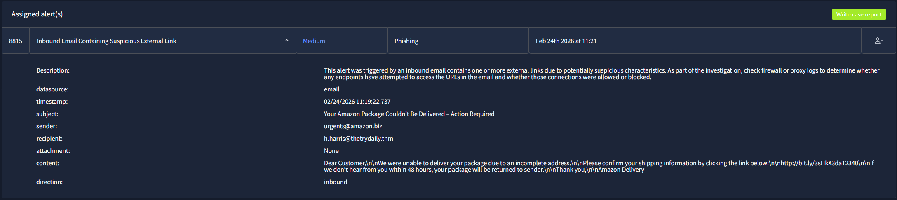

#### **Investigation:**

I reviewed the email sent from ```urgents@amazon.biz``` to ```h.harris@thetrydaily.thm``` (Hannah Harris) in Splunk.

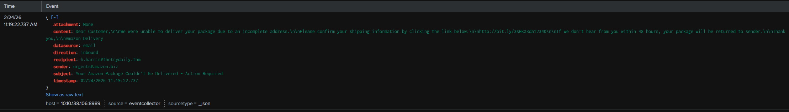

While the sender email returned as clean in the threat intel app, the embedded shortened URL (```http://bit.ly/3sHkX3da12340```) was flagged as malicious. 


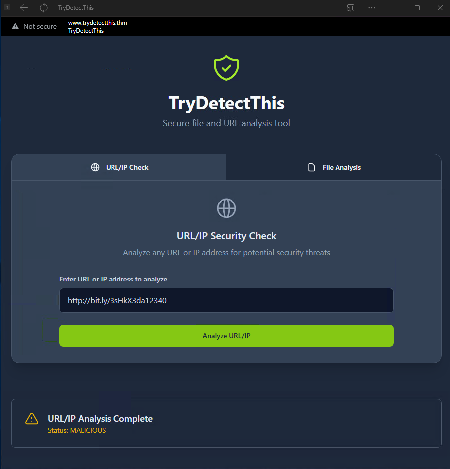

I then queried the firewall logs and found a matching event: Hannah Harris (IP ```10.20.2.17```) clicked the link and attempted to access the malicious destination IP (```67.199.248.11```) on port ```80```. Fortunately, the firewall action was "blocked". This alert perfectly correlates with the events investigated during Alert 8816.

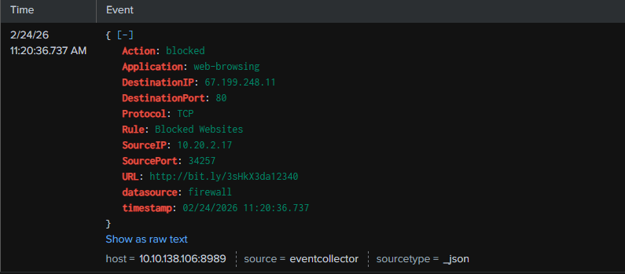

**Classification & Escalation:**
* **Classification:** True Positive.
* **Escalation:** Not required.

**Analyst Report:**
This activity is classified as a True Positive because there was a phishing attempt to user H. Harris (recipient ```h.harris@thetrydaily.thm```) from email sender ```urgents@amazon.biz```. Initially, the sender email was detected as clean, nonetheless, the email contained a shortened URL that was detected as malicious by the TryDetectThis App. The suspicious activity was detected at 11:19 on 02/24/2026. H. Harris clicked the attached shortened link from IP ```10.20.2.17``` on Port ```34257``` and accessed Destination IP ```67.199.248.11``` on Port 80, but the attempt was blocked by the firewall. No need for escalation because the firewall classified it as phishing, and quarantined it before any users had a chance to access the malicious email.

**AI Feedback & Lessons Learned:**
The AI validated my correlation of the email and firewall logs. It suggested a minor improvement: explicitly stating that "no remediation actions are required" to ensure absolute clarity for the incident response team reading the ticket.

---

### Alert 8817 - Inbound Email Containing Suspicious External Link
* **Severity:** Medium
* **Data Source:** Email
* **Timestamp:** 02/24/2026 11:21:40
* **Description:** This alert was triggered by an inbound email containing one or more external links due to potentially suspicious characteristics. As part of the investigation, check firewall or proxy logs to determine whether any endpoints have attempted to access the URLs in the email and whether those connections were allowed or blocked.

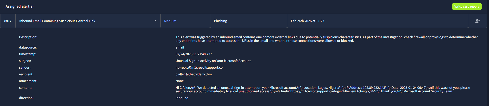

**Investigation:**
I investigated the email sent from ```no-reply@m1crosoftsupport.co``` (a clear typosquatting attempt) to ```c.allen@thetrydaily.thm``` (Charlotte Allen) on Splunk. 

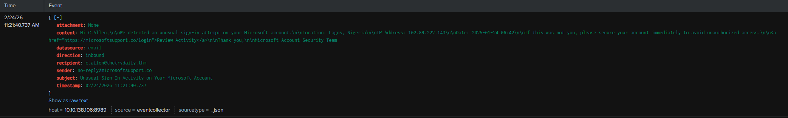

The embedded link (```https://m1crosoftsupport.co/login```) was analyzed in TryDetectThis and confirmed as malicious. 

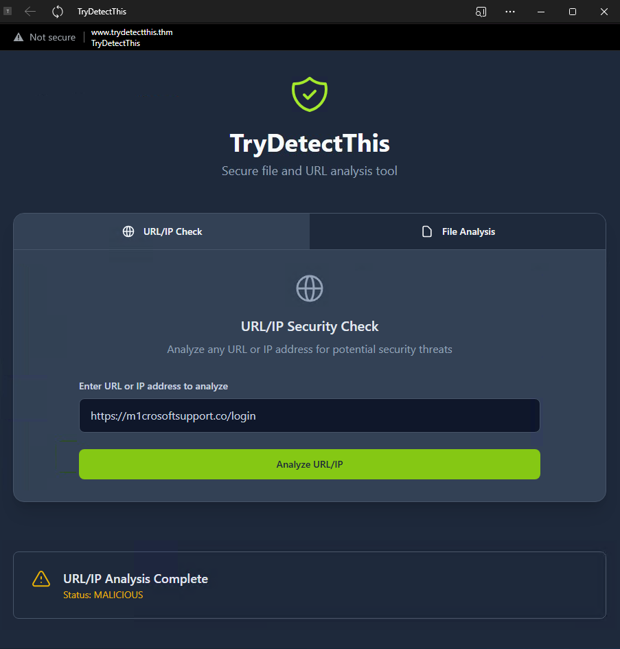

I pivoted to the firewall logs and discovered a critical event: at 11:22, Source IP ```10.20.2.25``` (Charlotte Allen) made a connection to the malicious Destination IP ```45.148.10.131``` on port ```443```, and the firewall action was recorded as "allowed" under the "Allow-Internet" rule.

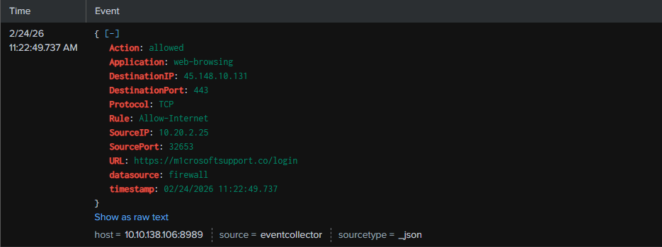

**Classification & Escalation:**
* **Classification:** True Positive.
* **Escalation:** Immediate escalation required.

**Analyst Report:**
This activity is classified as a True Positive due to the fact that it is a phishing attempt and a clear impersonation of Microsoft using a spoofed domain. This activity started at 11:21 on 02/24/2026 when sender email ```no-reply@m1crosoftsupport.co``` sent the suspicious email to email recipient ```c.allen@thetrydaily.thm```. At 11:22, user C.Allen clicked the attached external link from Source IP ```10.20.2.25``` on Port ```32653``` to Destination IP ```45.148.10.131:443```. The connection was allowed by the firewall. The attached URL is detected as malicious. Immediate escalation is required because the firewall allowed the connection, necessitating remediation actions like account lockout, host isolation, and password change.

**AI Feedback & Lessons Learned:**
The AI commended the identification of the typosquatting domain and the appropriate call for escalation. It highlighted the need to explicitly mention the *observed impact* (e.g., potential credential compromise) to clarify the severity of the incident. It also reminded me to strictly align timestamps to avoid reporting discrepancies.

---

## 4. Key Takeaways & Conclusion
This simulated environment reinforced the importance of the SOC triad: reviewing, investigating, and resolving. It highlighted how critical it is to correlate different data sources—such as cross-referencing an inbound phishing email with outbound firewall logs—to definitively determine if a user interacted with a malicious payload. Furthermore, the AI feedback loop emphasized that case reports must strictly adhere to the 5Ws (Who, What, When, Where, Why) while explicitly stating both the business impact and the exact required remediation steps to facilitate a rapid and decisive incident response.