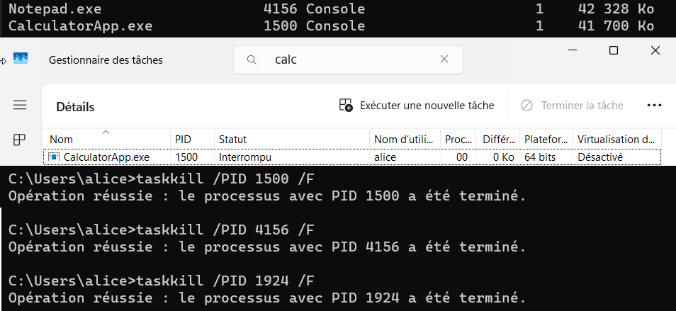
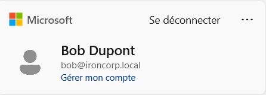
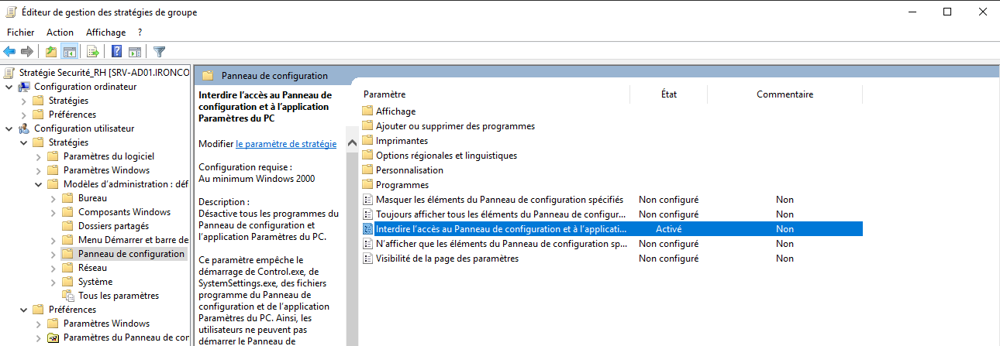
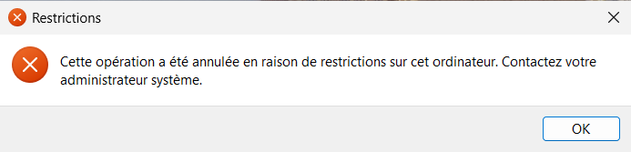
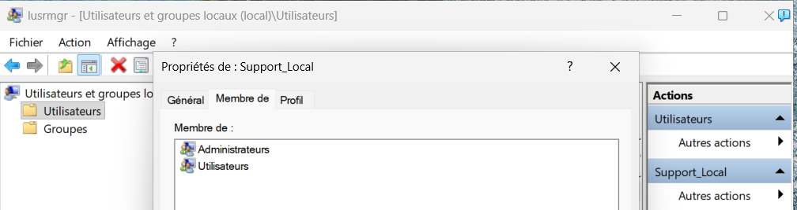
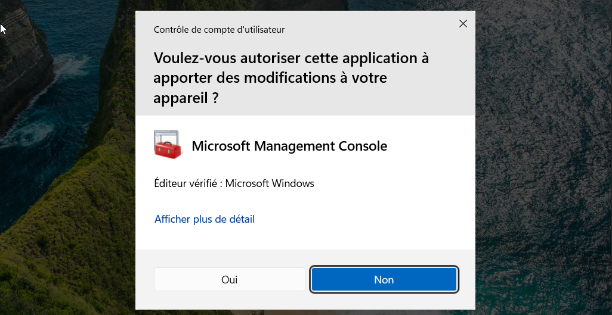

## Missions Pratiques (Home Lab)

Exercices réalisés sur mon environnement virtuel (Windows 11/Windows Server 2019) pour valider les compétences SOC.

### ✅ Mission 1 : Forensics & Processus (Windows 11) (Validée)
* **Objectif :** Identifier manuellement des processus suspects via leur PID et les neutraliser en ligne de commande (Simulation de réponse à incident).
* **Commandes exécutées :**
    1.  **Identification (GUI) :** Repérage des PID via le Gestionnaire des tâches (Onglet Détails) pour `CalculatorApp.exe` (1500), `Notepad.exe` (4156) et `msedge.exe` (1924).
    2.  **Neutralisation (CLI) :** Arrêt forcé des applications via la commande `taskkill` :
        * `taskkill /PID 1500 /F`
        * `taskkill /PID 4156 /F`
        * `taskkill /PID 1924 /F`
* **Preuve de réussite :**
    
    *(Confirmation : Les processus ont été terminés avec succès ("Opération réussie") correspondant aux PID ciblés).*

### ✅ Mission 2 : Logs & Audit de Sécurité (Windows 11) (Validée)
* **Objectif :** Détecter une tentative d'intrusion ou d'accès non autorisé en analysant les journaux de sécurité Windows (Event ID 4625).
* **Actions exécutées :**
    1.  **Simulation d'incident :** Tentative de connexion volontairement échouée (mauvais mot de passe) sur l'écran de verrouillage pour générer une log.
    2.  **Investigation :** Ouverture de l'**Observateur d'événements** (*Event Viewer*).
    3.  **Filtrage :** Dans *Journaux Windows > Sécurité*, application d'un filtre sur l'ID d'événement **4625** (Échec d'ouverture de session).
    4.  **Analyse :** Identification de l'événement correspondant à l'heure exacte de la tentative pour isoler l'incident.
* **Preuve de réussite :**
    
    *(Capture du journal de sécurité montrant clairement l'événement 4625 "Échec de l'audit", confirmant que le système a bien tracé la tentative ratée).*

### ✅ Mission 3 : Architecte Active Directory (Windows Server) (Validée)
* **Objectif :** Structurer l'annuaire pour un nouveau département (OU, Utilisateurs, Groupes) et valider la propagation des droits d'accès sur le réseau.
* **Actions exécutées :**
    1.  **Architecture (OU) :** Création d'une Unité d'Organisation dédiée `RH_Departement` à la racine du domaine pour isoler les ressources des ressources humaines.
    2.  **Provisioning (Utilisateurs) :** Création des comptes utilisateurs pour *Bob Dupont* et *Clara Ott* à l'intérieur de cette OU.
    3.  **Gestion des Accès (Groupes) :** Création du groupe de sécurité global `RH_Staff` et ajout des deux utilisateurs pour faciliter la gestion des permissions.
    4.  **Vérification (Client) :** Test de connexion réussi avec le compte de *Bob* sur la machine cliente Windows 11 jointe au domaine.
* **Preuve de réussite :**
    
    *(Confirmation côté Serveur : Bob et Clara sont bien membres du groupe de sécurité RH_Staff).*

    
    *(Confirmation côté Client : Bob a réussi à ouvrir sa session sur le poste Windows 11 via le domaine).*

### ✅ Mission 4 : GPO & Hardening (Windows Server) (Validée)
* **Objectif :** Appliquer une politique de sécurité (GPO) restrictive pour empêcher les utilisateurs d'une OU spécifique de modifier la configuration système (Hardening).
* **Actions exécutées :**
    1.  **Création GPO (Serveur) :** Dans la console de *Gestion de stratégie de groupe*, création de la stratégie `Securite_RH` liée à l'OU `RH_Department`.
    2.  **Configuration :** Activation du paramètre *Configuration utilisateur > Modèles d'administration > Panneau de configuration > "Interdire l'accès au Panneau de configuration et à l'application Paramètres du PC"*.
    3.  **Application (Client) :** Connexion avec l'utilisateur *Bob*, exécution de `gpupdate /force` pour récupérer immédiatement la nouvelle politique.
    4.  **Test de Restriction :** Tentative d'ouverture du Panneau de configuration, bloquée par le système.
* **Preuve de réussite :**
    
    *(Configuration côté Serveur : La GPO est activée et liée).*

    
    *(Validation côté Client : Message d'erreur explicite "Cette opération a été annulée en raison de restrictions...", prouvant que Bob ne peut plus accéder aux réglages).*

### ✅ Mission 5 : Gestion des Permissions NTFS & Moindre Privilège (Validée)
* **Objectif :** Sécuriser des données critiques (Salaires) en brisant l'héritage des droits et en appliquant un contrôle d'accès strict (RBAC) limité à la lecture seule pour un groupe spécifique.
* **Actions exécutées :**
    1.  **Isolation (Désactivation Héritage) :** Sur le dossier `C:\Salaires`, désactivation de l'héritage des permissions pour empêcher la propagation des droits par défaut depuis la racine `C:`.
    2.  **Nettoyage (Hardening) :** Suppression des groupes par défaut ("Utilisateurs", "Utilisateurs authentifiés") pour garantir qu'aucun accès implicite ne subsiste.
    3.  **Attribution des droits (RBAC) :** Ajout exclusif du groupe `RH_Staff` avec la permission **Lecture et exécution** uniquement.
    4.  **Test 1 (Autorisation Restreinte) :** Avec *Bob* (RH), l'accès au dossier est validé, mais la création de fichiers est bloquée (Permission d'écriture absente).
    5.  **Test 2 (Refus d'accès) :** Avec *Alice* (Non-RH), l'ouverture du dossier est immédiatement bloquée par Windows.
* **Preuve de réussite :**
    
    *(Configuration Serveur : L'héritage est coupé. Seuls les Admins, le Système et le groupe RH_Staff [Lecture] sont listés).*

    
    *(Test Bob (RH) : Il peut entrer dans le dossier (Lecture OK), mais ne peut rien créer (l'icône bouclier sur "Nouveau" prouve l'absence de droits d'écriture)).*

    
    *(Test Alice (Intruse) : Windows bloque l'accès à la racine du dossier, confirmant l'isolation totale).*

### ✅ Mission 6 : Administration Locale & UAC (Windows 11) (Validée)
* **Objectif :** Créer un compte d'administration de secours (hors domaine) et durcir le niveau de l'UAC (User Account Control) pour maximiser la sécurité locale.
* **Actions exécutées :**
    1.  **Compte de Secours :** Via `lusrmgr.msc`, création de l'utilisateur `Support_Local` et ajout au groupe *Administrateurs* local. Cela garantit un accès même si le contrôleur de domaine (AD) est hors ligne.
    2.  **Test UAC Standard :** Connexion avec `.\Support_Local`. Tentative d'exécution de CMD en tant qu'administrateur. La fenêtre UAC apparaît, prouvant que même un admin doit confirmer ses actions sensibles.
    3.  **Hardening (Durcissement) :** Modification des paramètres de contrôle de compte utilisateur vers le niveau maximum **"Toujours m'avertir"**.
    4.  **Test UAC Renforcé :** Lancement de `services.msc`. L'UAC intercepte maintenant l'ouverture de la console de gestion, ce qui n'était pas systématique ou aussi restrictif au niveau par défaut.
* **Preuve de réussite :**
    
    *(Création du compte de secours : L'utilisateur Support_Local est bien membre du groupe Administrateurs, indépendant du domaine).*
    
    *(Test initial : L'UAC intercepte l'élévation de privilèges pour l'invite de commande).*

    
    *(Configuration : Réglage du curseur sur le niveau de sécurité le plus élevé).*

    
    *(Test final : Avec le réglage maximum, l'accès aux consoles système comme Services.msc déclenche systématiquement une alerte).*